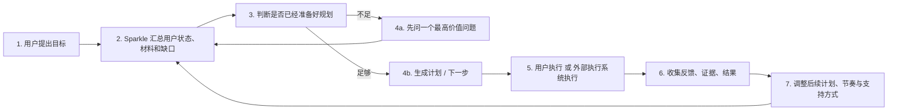
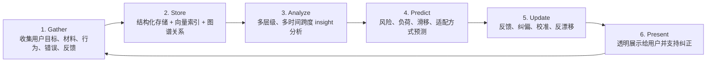
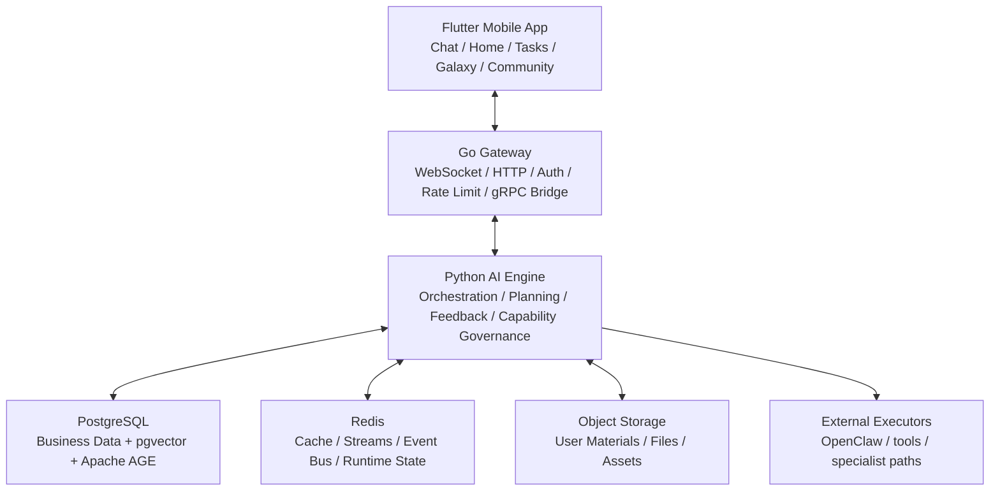
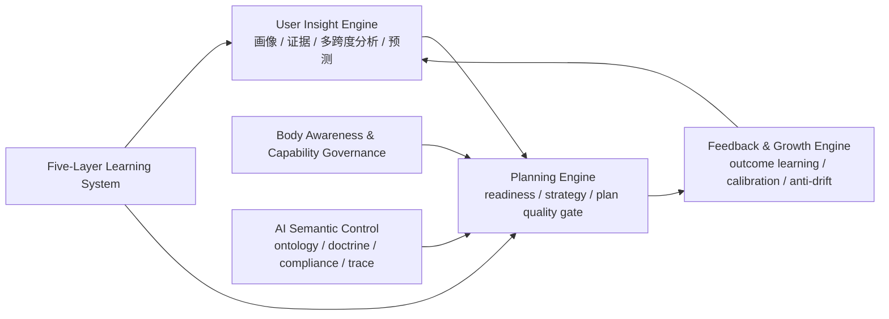

<div align="center">

# Sparkle 星火

### AI 原生的规划与成长操作系统

**Sparkle 不要求普通用户先学会 prompt engineering。它先理解用户，再把用户自己的信息变成更好的计划、更好的下一步和更好的持续指导。**

[](https://flutter.dev)
[](https://go.dev)
[](https://python.org)
[](https://www.postgresql.org/)
[](LICENSE)

**简体中文** · [English](README_EN.md) · [开发文档入口](docs/README.md)

</div>

---

## 一句话介绍

> **Sparkle 是一个 AI 原生的规划与指导操作系统，它能深度理解普通用户，并把用户自己的数据转化成比原始 AI 更好的计划、更好的下一步和更好的持续适应。**

---

## 我们现在在哪个阶段

Sparkle 已经不再是一个概念验证项目，也不是一个“多 Agent 技术展示”。

它已经完成了核心产品主干的 `v1` 建设：

- `用户 Profile / Insight 系统` 已形成统一编译主干
- `Planning Engine` 已具备 readiness gate、strategy compile 和 plan quality gate
- `Feedback / Growth Engine` 已具备 outcome learning、calibration 和 anti-drift
- `AI Semantic Control` 已形成统一 ontology、renderer、compliance 和 trace
- `Body Awareness` 与 `Five-Layer Learning` 已进入受治理的运行状态

当前项目已进入 `Stage 2`：

- 不再继续无休止地发明基础层
- 重点转向 `runnable golden path`
- 重点转向 `全链路产品一致性`
- 重点转向 `Live Alpha` 与 `真实人类验证`

这也是 Sparkle 当前最诚实、最强的定位：

> **一套核心智能系统已经搭好、正在从内部复杂性走向真实产品证明的 AI-native 产品。**

---

## Sparkle 解决什么问题

今天的大模型已经很强，但大多数普通用户仍然有三个现实问题：

1. 不知道该给 AI 什么信息
2. 不知道如何把自己的资料、错误、行为和限制组织成高质量上下文
3. 即使拿到了答案，也很难把它变成真正可执行、可持续、可纠偏的路径

Sparkle 的目标不是让用户变成 AI 专家。

Sparkle 的目标是：

- 帮用户更好地理解自己
- 帮用户更好地理解自己的目标与真实阻碍
- 帮用户把自己的数据变成更好的计划
- 帮用户在执行后继续得到有连续性的调整和指导

---

## Sparkle 为谁而做

Sparkle 首先不是为 prompt 工程高手设计的。

它优先服务的是：

- 有重要目标，但不会高质量使用 AI 的普通用户
- 有很多自己的材料、经历、错误和笔记，却不会利用的人
- 在高压或时间有限条件下，需要快速找到正确路径的人
- 想要持续成长，但缺乏外部结构和高质量反馈回路的人

典型场景：

- 14 天准备期末考试
- 用自己的资料快速构建学习计划
- 在过载、拖延、计划滑移后重新找回正确节奏
- 用长期数据慢慢建立一个真正“懂自己”的成长系统

---

## 产品的 4 个外部模式

这是最适合对评委、投资人、合作伙伴讲述的产品模式。

| 模式 | 用户看到什么 | Sparkle 在背后做什么 |
|:---|:---|:---|
| `Understand` | 先弄清你是谁、你要什么、你还缺什么 | 编译用户画像、证据、缺口和当前状态 |
| `Plan` | 给你最合适的计划、节奏和下一步 | 判断 readiness、编译策略、约束计划质量 |
| `Adapt` | 当现实变化时，计划会重新调整 | 读取反馈、结果、负荷、材料和执行状态 |
| `Grow` | 系统会越用越懂你，而且你能看见并纠正它 | 做校准、反漂移、透明展示和用户控制 |

内部当然还有 chat mode、experience mode、agent routing、tool routing 等运行机制，但对外最应该讲的是这 4 个模式。

---

## Sparkle 的两条真正 moat

Sparkle 不是靠“模型更多”取胜。

它的两条真正 moat 是：

| Moat | 含义 | 用户感受到的价值 |
|:---|:---|:---|
| `User Understanding Quality` | Sparkle 能从用户自己的目标、材料、行为、错误、反馈里看到用户自己不容易看清的东西 | “它真的理解我在卡什么。” |
| `Plan Quality` | Sparkle 不是泛泛回答，而是把理解转化成更合理的计划、节奏、分解和下一步 | “这个计划比我直接问 AI 更能落地。” |

我们最终想让用户用一句话描述 Sparkle：

> **它先真正理解我，再给我更好的路径。**

---

## 原始 AI 与 Sparkle 的区别

| 维度 | 原始 AI 直接使用 | Sparkle |
|:---|:---|:---|
| 上下文组织 | 用户自己做 prompt engineering | 系统主动判断缺口、编译上下文 |
| 用户理解 | 依赖当轮输入 | 依赖持续累积的 `UserInsightState` |
| 规划质量 | 往往直接给答案或通用计划 | 先判断 readiness，再给 grounded plan |
| 反馈学习 | 以单轮满意度为主 | 引入 outcome learning、calibration 和 anti-drift |
| 透明度 | 用户通常看不到系统如何理解自己 | 用户可以查看、纠正、控制自己的 insight |
| 连续性 | 多数是会话级 | 目标是跨会话、跨阶段持续改进 |

---

## 核心产品循环



这不是单轮问答，而是一个持续迭代的成长闭环。

---

## 我们最核心的数据利用循环

Sparkle 的核心原则不是“收集更多数据”，而是**把用户自己的数据利用得更深、更准、更可解释**。



这 6 个环节构成了 Sparkle 的长期壁垒：

- 不只是“能记住”
- 而是“能利用”
- 不只是“能利用”
- 而是“能被用户看见、验证和纠正”

---

## 最值得展示的技术设计

### 1. 用户 Insight 与 Profile 系统

Sparkle 不会在每一轮重新猜用户是谁。

它把用户自己的信息编译为统一的 `UserInsightState`，用于：

- 目标与约束理解
- 当前状态与瓶颈判断
- 多时间跨度分析
- 风险与滑移预测
- 透明画像与用户纠偏

这是 Sparkle “理解用户”的系统基础。

### 2. Planning Engine

Sparkle 不会在信息不足时礼貌地胡猜。

它会先判断：

- 是否已经准备好规划
- 是否应该先澄清
- 是否只能给暂定方案
- 是否必须基于用户材料显式 grounding

然后再进行规划，并通过质量门控约束最终输出。

### 3. AI Semantic Control

Sparkle 不是靠 prompt 中的裸标签控制模型。

我们为 AI 系统建立了：

- 统一策略本体
- 统一 doctrine renderer
- 行为级 semantic compliance
- 可追踪的 semantic control trace

这让模型更能理解“系统到底希望它怎样行为”，而不是自己猜控制词的含义。

### 4. Feedback / Growth / Anti-Drift

Sparkle 不只是记“用户喜不喜欢某句回答”。

它会继续学习：

- 哪种计划有效
- 哪种策略无效
- 用户纠正了哪些画像判断
- 哪些推断已经过时或应该降级

同时它会做：

- 置信度校准
- 失效信号剔除
- 作用域限制
- 漂移抑制

### 5. 透明与用户控制

Sparkle 的设计原则之一是：

> **用户应该能看到系统如何理解自己，并有权纠正它。**

所以系统支持：

- insight / prediction / unknowns 的可见化
- calibration 状态展示
- `wrong`
- `used_to_be_true`
- `exam_mode_only`
- `reset_override`

这也是 Sparkle 与很多大模型产品的重要区别。

---

## 系统架构总览



### AI 引擎内部主干



这三层图已经足够作为 README 和 BP 里的核心技术图。

---

## 我们最强的设计部分

如果要向评委或投资人强调 Sparkle 设计最强的地方，我建议讲这 6 点：

1. **统一的用户理解状态，而不是分散标签**
2. **先判断是否该规划，再决定如何规划**
3. **AI 行为控制是语义化、可解释、可追踪的**
4. **反馈学习是带治理和反漂移的**
5. **用户可以看见并修正系统对自己的理解**
6. **整套系统围绕“理解更深、计划更好”两个 moat 收敛**

---

## 北极星场景

当前最适合展示 Sparkle 价值的北极星场景是：

### 14 天热力学期末备考

用户会：

- 上传课件、笔记、作业、错题
- 说自己要在 14 天内准备考试
- 并不一定知道真正卡点是什么
- 在中途出现过载、拖延、计划滑移或方向错误

Sparkle 要做的不是“回答一道题”。

而是：

- 看懂用户真正的状态
- 识别还缺什么信息
- 给出合理计划
- 在负荷变化后做可见的适应
- 持续保持连续性和信任

这才是最能体现 Sparkle 产品价值的场景。

---

## 当前最重要的产品目标

现在最重要的问题不是“系统模块够不够多”。

现在最重要的问题是：

> **Sparkle 能不能作为一个真实可运行的产品，明显优于普通用户直接使用原始 AI？**

所以 Stage 2 的重点是：

- 跑通 runnable golden path
- 在真实 App 中展示完整体验
- 做第一轮人类评估与 transcript review
- 用真实使用结果而不是合成分数来判断产品价值

---

## 快速开始

### 环境要求

| 依赖 | 版本 |
|:---|:---|
| Go | 1.22+ |
| Python | 3.11+ |
| Flutter | 3.24+ |
| Docker / Docker Compose | 24+ / 2.x |

### 本地启动

```bash
# 1. 克隆项目
git clone https://github.com/BRSAMAyu/Sparkle-project.git
cd Sparkle-project

# 2. 配置环境变量
cp backend/.env.example backend/.env
cp backend/gateway/.env.example backend/gateway/.env

# 3. 启动基础设施
make dev-up

# 4. 同步数据库 / 生成代码
make sync-db
make proto-gen

# 5. 启动 Python AI 引擎
make grpc-server

# 6. 启动 Go Gateway
make gateway-dev

# 7. 启动移动端
cd mobile && flutter run
```

### 常用命令

```bash
make dev-up
make grpc-server
make gateway-dev
make proto-gen
make sync-db

cd backend && pytest
cd backend/gateway && go test ./...
cd mobile && flutter test
```

---

## 仓库结构

```text
Sparkle-project/
├── mobile/                  # Flutter 客户端
├── backend/app/             # Python AI 引擎
├── backend/gateway/         # Go Gateway
├── proto/                   # gRPC 协议定义
├── docs/                    # 产品、架构、验证文档
├── scripts/                 # 启动、验收、工具脚本
└── docker-compose.yml       # 本地基础设施
```

---

## 关键文档

- [开发文档入口](docs/README.md)
- [产品 Thesis 与重构路线](docs/product/SPARKLE_PRODUCT_THESIS_AND_REFOCUSED_ROADMAP_2026-04-05.md)
- [Stage 2 Product Coherence & Live Alpha Plan](docs/product/SPARKLE_STAGE2_PRODUCT_COHERENCE_AND_LIVE_ALPHA_PLAN_2026-04-06.md)
- [Stage 2 Product Coherence Execution Plan](docs/product/implementation/SPARKLE_STAGE2_PRODUCT_COHERENCE_EXECUTION_PLAN_2026-04-06.md)
- [Stage 2 Profile & Insight System Plan](docs/product/implementation/SPARKLE_STAGE2_PROFILE_AND_INSIGHT_SYSTEM_EXECUTION_PLAN_2026-04-06.md)
- [AI Semantic Control Plan](docs/product/implementation/SPARKLE_AI_SYSTEM_SEMANTIC_CONTROL_EXECUTION_PLAN_2026-04-06.md)
- [Data Utilization Analysis](docs/product/SPARKLE_DATA_UTILIZATION_ANALYSIS_2026-04-06.md)

---

## 当前判断

Sparkle 当前最准确的描述不是“一个大而全的 AI 平台”。

而是：

> **一个已经完成核心智能系统搭建、正在进入真实产品证明阶段的 AI-native 规划与成长操作系统。**

如果你要在 GitHub 上向别人介绍它，这就是最重要的共识。

---

## License

本项目采用 [MIT License](LICENSE)。
