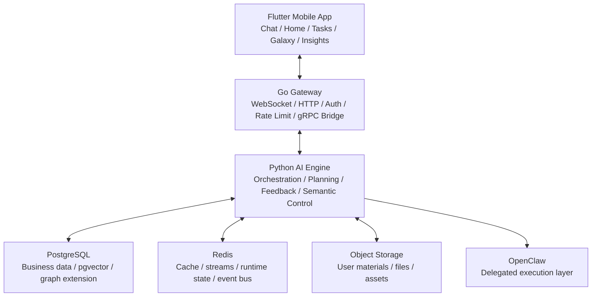

<div align="center">

# Sparkle 星火

### AI 原生的学习成长系统

**Sparkle 不是让普通用户先学会 prompt engineering，而是先理解用户，再把用户自己的信息转化成更好的计划、更好的下一步和更长期的自适应支持。**

[](https://flutter.dev)
[](https://go.dev)
[](https://python.org)
[](https://www.postgresql.org/)


**简体中文** · [English](README_EN.md) · [开发文档入口](docs/README.md)

</div>

---

## Sparkle 是什么

Sparkle 的签字定义已经收敛为一个更准确的表述：

> **Sparkle 是一个 AI 学习成长系统。**

短期形态，它可以被理解为一位 AI 学习教练；长期形态，它会演进为 AI 成长操作系统。这不是两个彼此分离的产品，而是一条连续演进的曲线。

Sparkle 的核心任务不是“多聊几轮”，而是把用户的目标、材料、限制、行为、错误和反馈组织成一个可持续演化的理解状态，再用这个状态生成更 grounded 的计划、更可靠的节奏和更合适的下一步。

---

## 为什么它重要

今天的大模型已经很强，但普通用户在真实目标场景里仍然会卡在三个地方：

1. 不知道该给 AI 什么信息。
2. 不知道如何把自己的资料、行为、错误和限制组织成高质量上下文。
3. 即使拿到了答案，也很难把它变成真正可执行、可持续、可纠偏的路径。

Sparkle 的目标不是把用户训练成 AI 专家，而是替用户承担这部分“理解、组织、规划、适配”的系统工作。

当前最清晰的北极星场景仍然是：

> **14 天准备热力学期末考试**

在这个场景里，Sparkle 不只是回答问题，而是要看懂用户真实处境，判断还缺什么，生成计划，并在过载、偏移、失败或反馈之后继续调整。

---

## 它如何理解用户

Sparkle 当前对外最稳定的表达仍然是四个模式：

| 模式 | 用户看到什么 | 系统在背后做什么 |
|:---|:---|:---|
| `Understand` | 先弄清你是谁、你要什么、还缺什么 | 编译画像、证据、缺口和当前状态 |
| `Plan` | 给出最合适的计划、节奏和下一步 | 判断 readiness，编译策略，并约束计划质量 |
| `Adapt` | 当现实变化时，路径会跟着变 | 读取反馈、结果、负荷、材料和执行状态 |
| `Grow` | 系统会越用越懂你，而且你能看见并纠正它 | 做校准、反漂移、透明展示和用户控制 |

这背后真正支撑 Sparkle 的，是三组更稳定的产品共识：

- `双核协作`：执行核负责目标澄清、充分性评估、计划与执行调整；认知核负责用户画像、记忆、情绪/动机/状态理解与持续陪伴。两核必须协作，而不是并行孤岛。
- `五层用户模型`：从 raw evidence、projection、inference，到 Aurora shadow 和用户纠偏，系统按层处理理解与更新，不让推断静默污染事实层。
- `关系姿态`：Sparkle 不是工具式 prompt 工程，也不只是“助手人格”；它强调可校准、可纠偏、朋友式持续陪伴，同时保留独立判断。

---

## 为什么 Sparkle 不一样

Sparkle 的核心 moat 仍然收敛在两条线上：

| Moat | 含义 | 用户感受到的价值 |
|:---|:---|:---|
| `User Understanding Quality` | 系统能从用户自己的目标、材料、行为、错误和反馈里看到用户不容易独自看清的东西 | “它真的理解我卡在哪里。” |
| `Plan Quality` | 系统不是泛泛回答，而是把理解转化成更可执行的计划、节奏、分解和下一步 | “这个计划比我直接问 AI 更落地。” |

和原始 AI 直接使用相比，Sparkle 的差异在于：

| 维度 | 原始 AI 直接使用 | Sparkle |
|:---|:---|:---|
| 上下文组织 | 用户自己做 prompt engineering | 系统主动判断缺口并编译上下文 |
| 用户理解 | 高度依赖当前轮输入 | 建立在持续累积的理解状态与证据链之上 |
| 规划质量 | 往往是通用答案或通用计划 | 先判断是否准备好规划，再给 grounded plan |
| 反馈学习 | 多数停留在单轮满意度 | 进入 outcome learning、calibration 和 anti-drift |
| 透明度 | 用户通常看不到系统如何理解自己 | 用户可以查看、纠正和控制自己的 insight |
| 连续性 | 多数是会话级 | 目标是跨会话、跨阶段持续改进 |

---

## 系统架构

Sparkle 当前仍然是一个三层混合系统：`Flutter Mobile + Go Gateway + Python AI Engine`，并由 PostgreSQL、Redis、对象存储和外部执行层共同支撑。



### 为什么是这套结构

| 组件 | 角色 | 为什么存在 |
|:---|:---|:---|
| `Flutter Mobile` | 真实产品入口 | 承载聊天、主页、任务、星图、洞察等用户体验 |
| `Go Gateway` | 接入与桥接层 | 负责 WebSocket / HTTP 接入、鉴权、连接治理，以及到 Python gRPC 的转发 |
| `Python AI Engine` | 智能主引擎 | 负责上下文编译、规划、工具调用、反馈学习和语义控制 |
| `FastAPI` | 业务 API 层 | 承载资源管理、文件、设置、干预、观测等 HTTP 能力 |
| `gRPC AgentService` | AI 主通信协议 | 承载主聊天链路中的流式 AI 请求与结构化响应 |
| `PostgreSQL` | 事实与业务数据源 | 存用户、任务、计划、反馈、知识状态等核心数据 |
| `Redis` | 运行时与事件层 | 用于缓存、streams、事件总线、运行态和部分状态同步 |
| `Object Storage / MinIO` | 材料与文件层 | 承载用户上传材料、文件和资产 |
| `OpenClaw` | 外部执行层 | 负责被委派的真实执行任务，但不是 Sparkle 的产品本体 |

### 主产品请求路径

当前真实主聊天链路不是直接打 Python HTTP，而是：

`Flutter -> /ws/chat -> Go Gateway -> gRPC AgentService -> Python ChatOrchestrator`

对应关系大致是：

1. Flutter 端主聊天服务通过 WebSocket 连接 Gateway。
2. Go Gateway 负责连接、鉴权、消息治理和协议桥接。
3. Gateway 调用 Python 的 `AgentService.StreamChat`。
4. Python `ChatOrchestrator` 组装上下文、决定策略、调用工具、生成流式结果。
5. 结果再经 Gateway 回到 App，驱动文本、卡片、工具结果和干预表达。

---

## 当前状态

Sparkle 已经不再是概念验证项目，也不是“多 Agent 炫技 demo”。

截至 `2026-04-24`，仓库内可追溯的主线状态是：

- `Stage 3-40` 的文档链、实现链、可执行验收链已完成收束。
- `Phase I Exit Gate` 已签字，结论是 `ready with exception / YES`。
- `Rule BD` 仍然保持 `CONDITIONAL`，因为 SGW 真跑仍依赖完整后端栈，不把它表述为 unconditional。

当前首页可以安全引用的硬指标包括：

| 指标 | 当前状态 | 依据 |
|:---|:---|:---|
| `scripts/run_all_rule_guards.sh` | `59/59 PASS` | `docs/audit/STAGE3_40_FULL_CLOSEOUT_VERIFICATION_2026-04-24.md` |
| 核心 kill switch 三态化 | `12/12` | `docs/product/SPARKLE_AURORA_PHASE_I_EXIT_GATE_2026-04-22.md` |
| Mobile black-hole rate | `0.000%` | `docs/product/SPARKLE_AURORA_STAGE35_HANDOFF_2026-04-22.md` |
| top-50 hot files Core/Phase 声明头覆盖率 | `100%` | `docs/product/SPARKLE_AURORA_PHASE_I_EXIT_GATE_2026-04-22.md` |

今天更准确的描述是：

> **Sparkle 已从“核心概念搭建阶段”进入“治理闭环完成、准备做 RL 精调与真实运行优化”的阶段。**

---

## 最近阶段进展

README 不逐 stage 记流水账，但从 `Stage 22` 到 `Stage 40`，主线已经形成了几段清晰的能力闭环。

### Stage 22-23：把可见上下文、结果闭环与拟真基线补齐

- 建立了 prompt coverage 审计，并把 `achievement_summary`、`calendar_context` 等 read-visible context 接入主链。
- 修复了 `error -> replan -> verify -> learn` 的闭环，让错误驱动的调整不再落在漏水管道上。
- 补齐了 seed adoption / withdrawal 闭环、outcome backfill、source-state registry。
- 建立了 Stage 23 synthetic density bootstrap：3 个 synthetic users、每人 150 组 decision→outcome pairs，用于 Bayesian 与后续策略评估。

### Stage 24-35：把策略、认知与移动端主干真正接上

- 完成了 policy、reflection、scene、foresight、SRL、metacognition、mobile parity 等主干接线。
- `working_memory_snapshot`、`achievement_summary`、`active_skills_summary`、`engagement_state`、`foresight_hint` 等状态已进入真实主链，而不只是文档概念。
- mobile parity 被纳入治理，`UserStateV1` 的真实消费与 backend-only 字段边界被显式化。

### Stage 34-40：把治理、drill 与 Exit Gate 收口

- 接通了 event subscribers、journey smoke、context assembly 与更多 prompt-visible state。
- 完成 kill switch 三态化、guard manifest 收口、calendar prompt kill switch、drill playbook 与 consolidated drill。
- 完成 Phase I Exit Gate，并把 Phase II 的 RL 优化方向从“想法”冻结成可执行 handoff。

权威入口：

- [愿景锚定清单](docs/product/SPARKLE_VISION_ANCHOR_LIST_2026-04-19.md)
- [Stage 40 Handoff](docs/product/SPARKLE_AURORA_STAGE40_HANDOFF_2026-04-22.md)
- [Stage 40 Main Integration Report](docs/audit/STAGE40_MAIN_INTEGRATION_REPORT_2026-04-23.md)
- [Phase I Exit Gate](docs/product/SPARKLE_AURORA_PHASE_I_EXIT_GATE_2026-04-22.md)
- [SGW v2 RL System Handoff](docs/sgw/07_rl_system_handoff.md)

---

## 拟真 / 评估 / RL 脚手架

仓库当前已经不只是“有一些阶段文档”，而是具备了一套完整的拟真、评估与 RL 准备脚手架。

### 数据与拟真输入

- Stage 23 已建立 synthetic density bootstrap，可生成 synthetic users 与 decision→outcome pairs。
- 种子库、source-state registry、outcome backfill 已经形成可追踪的数据输入与反馈回路。
- 这套基础设施的目标不是造 demo 数据，而是为策略评估、行为验证和后续 RL 优化提供可重复输入。

### 交互与评估

- 仓库内已有 `Soul Drift Evaluation Harness`，用于区分 governed companion growth 和 stylized personality drift。
- 已有 `Phase D Evaluation Harness`，用于 body-aware selection、fallback reporting 与 blocked-organ simulation 的回归验证。
- 主链还配有 `journey smoke`、stage drill 脚本和全局 rule guards，用于持续验证产品链路和治理约束。

### RL 准备

- SGW v2 已具备 `off / shadow / rl` 三模式。
- RL CLI 契约、指标、rollout gates、rollback red lines 已冻结到 handoff 文档中。
- Phase II 的主题已经明确为：**优化现有回路，而不是继续扩张新功能面。**

当前 README 对 RL 的表述边界是：

- 可以表述为“RL scaffolding 与 Phase II 入场凭证已具备”。
- 不表述为“RL 已在真实生产中 fully rolled out”。

---

## 快速开始

当前主开发路径仍是 `Flutter + Go Gateway + Python AI Engine` 的本地三层协同。

### 最短启动路径

```bash
cp .env.example .env
cp backend/.env.example backend/.env
cp backend/gateway/.env.example backend/gateway/.env

make dev-up
make sync-db
make proto-gen
```

然后在多个终端分别运行：

```bash
make grpc-server
make gateway-dev
cd mobile && flutter pub get && flutter run
```

### 这几个命令分别做什么

| 命令 | 作用 |
|:---|:---|
| `make dev-up` | 启动 PostgreSQL、Redis、MinIO 等基础设施 |
| `make sync-db` | 执行迁移并同步 Go 侧数据库 schema / SQLC 代码 |
| `make proto-gen` | 重新生成 gRPC / protobuf 相关代码 |
| `make grpc-server` | 启动 Python gRPC AI 引擎 |
| `make gateway-dev` | 以开发模式启动 Go Gateway |

### 常用开发命令

| 命令 | 场景 |
|:---|:---|
| `make dev-all` | 查看完整启动指引 |
| `make api-server` | 启动 Python FastAPI 业务 API |
| `cd backend && pytest` | 跑 Python 测试 |
| `cd backend/gateway && go test ./...` | 跑 Go 测试 |
| `cd mobile && flutter test` | 跑 Flutter 测试 |

### 治理与主干验证

如果你要验证当前主干治理状态，优先看这两个入口：

- `scripts/run_all_rule_guards.sh`
  用于全局规则、守卫与治理约束回归验证。
- `scripts/stage40/drill_all.sh`
  用于 Stage 40 kill switch 与主干收口 drill。

---

## 仓库导航

| 路径 | 主要内容 | 什么时候看 |
|:---|:---|:---|
| `mobile/` | Flutter 客户端与真实产品体验 | 看用户流程、页面和交互时 |
| `backend/app/` | Python AI 引擎、FastAPI、编排与状态系统 | 看智能逻辑、规划、反馈、API 时 |
| `backend/gateway/` | Go Gateway、WebSocket / HTTP 接入、gRPC 桥接 | 看主聊天链路、鉴权和连接治理时 |
| `proto/` | gRPC 协议定义 | 改跨服务接口时 |
| `docs/product/` | 路线图、handoff、vision anchor、阶段共识 | 做产品判断或对齐阶段状态时 |
| `docs/audit/` | Stage 40 集成、主线恢复、closeout verification | 追溯当前主线已验证状态时 |
| `docs/sgw/` | SGW、MDP、rollout gate、RL handoff | 看拟真、评估与 RL 方向时 |
| `scripts/stage*/` | stage gate、drill、dogfood、rule guard | 需要执行阶段验证时 |
| `docs/README.md` | 文档总入口 | 第一次进入仓库时 |

---

## 延伸阅读

- [开发文档入口](docs/README.md)
- [愿景锚定清单](docs/product/SPARKLE_VISION_ANCHOR_LIST_2026-04-19.md)
- [Stage 3-40 Full Closeout Verification](docs/audit/STAGE3_40_FULL_CLOSEOUT_VERIFICATION_2026-04-24.md)
- [Roadmap Implementation Verification](docs/audit/ROADMAP_IMPLEMENTATION_VERIFICATION_2026-04-24.md)
- [Stage 40 Main Integration Report](docs/audit/STAGE40_MAIN_INTEGRATION_REPORT_2026-04-23.md)
- [Phase I Exit Gate](docs/product/SPARKLE_AURORA_PHASE_I_EXIT_GATE_2026-04-22.md)
- [Phase II RL Optimization Kickoff](docs/product/SPARKLE_AURORA_PHASE_II_RL_OPTIMIZATION_KICKOFF_2026-04-22.md)
- [SGW v2 RL System Handoff](docs/sgw/07_rl_system_handoff.md)

---

## 许可协议

本项目当前按 MIT License 口径维护。
