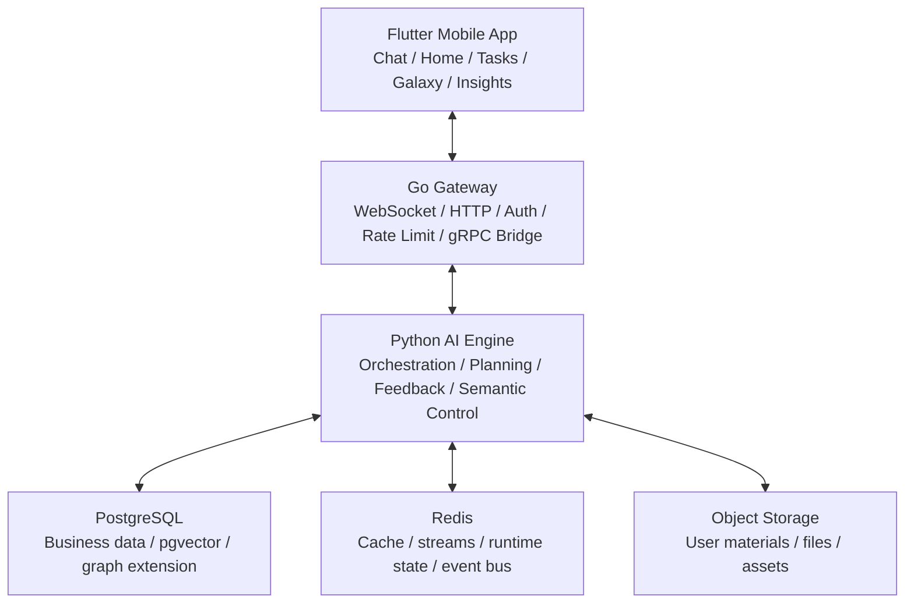

<div align="center">

# Sparkle 星火

### AI 原生的学习成长系统

**Sparkle 不是让普通用户先学会 prompt engineering，而是先理解用户，再把用户自己的信息转化成更好的计划、更好的下一步和更长期的自适应支持。**

[](https://flutter.dev)
[](https://go.dev)
[](https://python.org)
[](https://www.postgresql.org/)


**简体中文** · [English](README_EN.md) · [开发文档入口](docs/README.md)

</div>

---

## Sparkle 是什么

> **Sparkle 是一个 AI 学习成长系统。**

短期形态，它可以被理解为一位 AI 学习教练；长期形态，它会演进为 AI 成长操作系统。这不是两个彼此分离的产品，而是一条连续演进的曲线。

Sparkle 的核心任务不是"多聊几轮"，而是把用户的目标、材料、限制、行为、错误和反馈组织成一个可持续演化的理解状态，再用这个状态生成更 grounded 的计划、更可靠的节奏和更合适的下一步。

## 为什么它重要

今天的大模型已经很强，但普通用户在真实目标场景里仍然会卡在三个地方：

1. 不知道该给 AI 什么信息。
2. 不知道如何把自己的资料、行为、错误和限制组织成高质量上下文。
3. 即使拿到了答案，也很难把它变成真正可执行、可持续、可纠偏的路径。

Sparkle 的目标不是把用户训练成 AI 专家，而是替用户承担这部分"理解、组织、规划、适配"的系统工作。

## 它如何理解用户

| 模式 | 用户看到什么 | 系统在背后做什么 |
|:---|:---|:---|
| `Understand` | 先弄清你是谁、你要什么、还缺什么 | 编译画像、证据、缺口和当前状态 |
| `Plan` | 给出最合适的计划、节奏和下一步 | 判断 readiness，编译策略，并约束计划质量 |
| `Adapt` | 当现实变化时，路径会跟着变 | 读取反馈、结果、负荷、材料和执行状态 |
| `Grow` | 系统会越用越懂你，而且你能看见并纠正它 | 做校准、反漂移、透明展示和用户控制 |

支撑它的是三组产品共识：**双核协作**（执行核 + 认知核，经 DualCoreRouter 协作）、**五层用户模型**（raw evidence → projection → inference → shadow → 用户纠偏，推断不污染事实层）、**关系姿态**（可校准、可纠偏的朋友式持续陪伴）。

## 为什么 Sparkle 不一样

| 维度 | 原始 AI 直接使用 | Sparkle |
|:---|:---|:---|
| 上下文组织 | 用户自己做 prompt engineering | 系统主动判断缺口并编译上下文 |
| 用户理解 | 高度依赖当前轮输入 | 建立在持续累积的理解状态与证据链之上 |
| 规划质量 | 往往是通用答案或通用计划 | 先判断是否准备好规划，再给 grounded plan |
| 反馈学习 | 多数停留在单轮满意度 | 进入 outcome learning、calibration 和 anti-drift |
| 透明度 | 用户通常看不到系统如何理解自己 | 用户可以查看、纠正和控制自己的 insight |
| 连续性 | 多数是会话级 | 跨会话、跨阶段持续改进 |

## 系统架构



**主产品请求路径**：`Flutter → /ws/chat → Go Gateway → gRPC AgentService → Python ChatOrchestrator`

| 组件 | 角色 |
|:---|:---|
| `Flutter Mobile` | 真实产品入口：聊天、主页、任务、星图、洞察等体验 |
| `Go Gateway` | 接入与桥接：WebSocket/HTTP、鉴权、连接治理、gRPC 转发 |
| `Python AI Engine` | 智能主引擎：上下文编译、规划、工具调用、反馈学习 |
| `FastAPI` | 业务 API 层：资源、文件、设置、干预、观测 |
| `PostgreSQL 16` | 事实与业务数据（pgvector + Apache AGE） |
| `Redis / MinIO / Celery` | 运行时、事件、对象存储与异步任务 |

## 快速开始

```bash
cp .env.example .env && cp backend/.env.example backend/.env && cp backend/gateway/.env.example backend/gateway/.env

make dev-up        # PostgreSQL(16+AGE+pgvector) / Redis / MinIO
make sync-db       # Alembic 迁移 → schema 导出 → SQLC 生成
make proto-gen     # 重新生成 gRPC 代码

make grpc-server   # 终端 1：Python AI 引擎 :50051
make gateway-dev   # 终端 2：Go 网关 :8080
cd mobile && flutter pub get && flutter run   # 终端 3：移动端
```

测试：`cd backend && pytest` ｜ `cd backend/gateway && go test ./...` ｜ `cd mobile && flutter test`

## 仓库导航

| 路径 | 主要内容 |
|:---|:---|
| `mobile/` | Flutter 客户端 |
| `backend/app/` | Python AI 引擎、FastAPI、编排与状态系统 |
| `backend/gateway/` | Go 网关 |
| `proto/` | gRPC 协议定义（单一事实来源） |
| `docs/` | 工程文档（[入口](docs/README.md)） |
| `docs/competition/` | 参赛材料（填写指南、计划书） |
| `docs/engineering/` | 工程规范、仓库整洁标准、已知代码债务台账 |
| `scripts/` | 治理守卫与工具脚本 |

## 延伸阅读

- [开发文档入口](docs/README.md)
- [编码代理深度指南](docs/00_项目概览/05_编码代理深度指南.md)
- [仓库设计规范](docs/engineering/REPOSITORY_STANDARDS.md)
- [参赛材料](docs/competition/README.md)

---

## 许可协议

本项目按 MIT License 口径维护。
