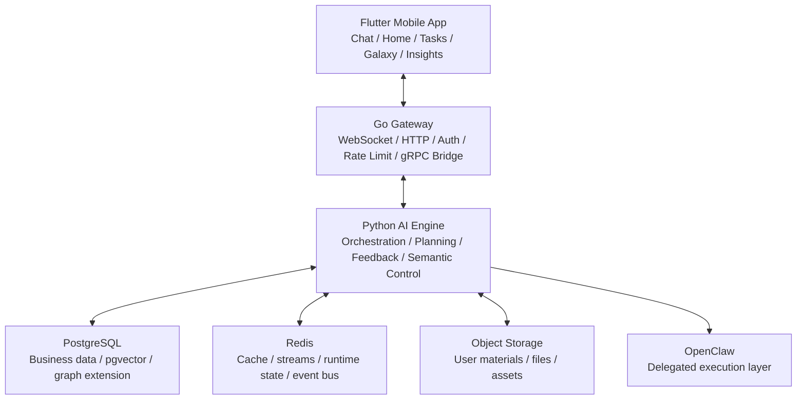
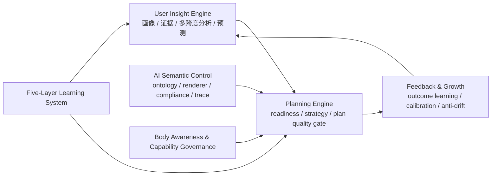

<div align="center">

# Sparkle 星火

### AI 原生的规划与成长操作系统

**Sparkle 不是让普通用户学会 prompt engineering，而是先理解用户，再把用户自己的信息转化成更好的计划、更好的下一步和更好的持续适应。**

[](https://flutter.dev)
[](https://go.dev)
[](https://python.org)
[](https://www.postgresql.org/)
[](LICENSE)

**简体中文** · [English](README_EN.md) · [开发文档入口](docs/README.md)

</div>

---

## Sparkle 是什么

Sparkle 是一个 **AI-native 的规划与指导系统**。它的核心不是聊天本身，而是把用户的目标、材料、限制、行为、错误和反馈组织成一个持续演化的理解状态，再用这个状态去生成更好的计划、节奏和下一步。

一句话说：

> **Sparkle 先真正理解你，再给你更好的路径。**

---

## 为什么它重要

今天的大模型已经很强，但大多数普通用户在真实目标场景中仍然会卡在三个地方：

1. 不知道该给 AI 什么信息
2. 不知道如何把自己的资料、行为、错误和限制组织成高质量上下文
3. 即使拿到了答案，也很难把它变成真正可执行、可持续、可纠偏的路径

Sparkle 的目标不是把用户训练成 AI 专家，而是替用户承担这部分“理解、组织、规划、适配”的系统工作。

---

## 它为谁而做

Sparkle 优先服务的不是 prompt 工程高手，而是这些人：

- 有重要目标，但不会高质量使用 AI 的普通用户
- 手里有很多自己的资料、笔记、错题、经历，却不会把它们转化成有效帮助的人
- 在 deadline、压力和负荷波动中，需要快速找对路径的人
- 想长期成长，但缺乏高质量结构与反馈回路的人

当前最能体现 Sparkle 价值的北极星场景仍然是：

> **14 天准备热力学期末考试**

在这个场景里，Sparkle 不只是回答问题，而是要看懂用户真正的状态，判断还缺什么信息，生成合理计划，并在过载、拖延、滑移和反馈之后继续做可见的调整。

---

## Sparkle 如何工作

Sparkle 当前最稳定的产品表达是四个模式：

| 模式 | 用户看到什么 | 系统在背后做什么 |
|:---|:---|:---|
| `Understand` | 先弄清你是谁、你要什么、还缺什么 | 编译用户画像、证据、缺口和当前状态 |
| `Plan` | 给出最合适的计划、节奏和下一步 | 判断 readiness，编译策略，并约束计划质量 |
| `Adapt` | 当现实变化时，计划会跟着变 | 读取反馈、结果、负荷、材料和执行状态 |
| `Grow` | 系统会越用越懂你，而且你能看见并纠正它 | 做校准、反漂移、透明展示和用户控制 |

这意味着 Sparkle 不是单轮问答系统，而是一个围绕目标达成持续迭代的闭环。

---

## 为什么 Sparkle 不一样

Sparkle 不是靠“模型更多”取胜，它真正收敛在两条 moat 上：

| Moat | 含义 | 用户感受到的价值 |
|:---|:---|:---|
| `User Understanding Quality` | 系统能从用户自己的目标、材料、行为、错误和反馈里看到用户不容易独自看清的东西 | “它真的理解我卡在哪里。” |
| `Plan Quality` | 系统不是泛泛回答，而是把理解转化成更可执行的计划、节奏、分解和下一步 | “这个计划比我直接问 AI 更落地。” |

和原始 AI 直接使用相比，Sparkle 的差异在于：

| 维度 | 原始 AI 直接使用 | Sparkle |
|:---|:---|:---|
| 上下文组织 | 用户自己做 prompt engineering | 系统主动判断缺口并编译上下文 |
| 用户理解 | 高度依赖当前轮输入 | 建立在持续累积的 `UserInsightState` 之上 |
| 规划质量 | 往往是通用答案或通用计划 | 先判断是否准备好规划，再给 grounded plan |
| 反馈学习 | 多数停留在单轮满意度 | 进入 outcome learning、calibration 和 anti-drift |
| 透明度 | 用户通常看不到系统如何理解自己 | 用户可以查看、纠正和控制自己的 insight |
| 连续性 | 多数是会话级 | 目标是跨会话、跨阶段持续改进 |

---

## 系统架构

Sparkle 当前是一个三层混合系统：`Flutter Mobile + Go Gateway + Python AI Engine`，并由 PostgreSQL、Redis、对象存储和外部执行层共同支撑。



### 为什么是这套结构

| 组件 | 角色 | 为什么存在 |
|:---|:---|:---|
| `Flutter Mobile` | 真实产品入口 | 承载聊天、主页、任务、星图、洞察等用户体验 |
| `Go Gateway` | 接入与桥接层 | 负责 WebSocket / HTTP 接入、鉴权、连接治理、以及到 Python gRPC 的转发 |
| `Python AI Engine` | 智能主引擎 | 负责上下文编译、规划、工具调用、反馈学习和语义控制 |
| `FastAPI` | 业务 API 层 | 承载资源管理、文件、设置、干预、观测等 HTTP 能力 |
| `gRPC AgentService` | AI 主通信协议 | 承载主聊天链路中的流式 AI 请求与结构化响应 |
| `PostgreSQL` | 事实与业务数据源 | 存用户、任务、计划、反馈、知识状态等核心数据 |
| `Redis` | 运行时与事件层 | 用于缓存、streams、事件总线、运行态和部分状态同步 |
| `Object Storage / MinIO` | 材料与文件层 | 承载用户上传材料、文件和资产 |
| `OpenClaw` | 外部执行层 | 负责被委派的真实执行任务，但不是 Sparkle 的产品本体 |

### 主产品请求路径

当前真实主聊天链路不是直接打 Python HTTP，而是：

`Flutter -> /ws/chat -> Go Gateway -> gRPC AgentService -> Python ChatOrchestrator`

对应关系大致是：

1. Flutter 端主聊天服务通过 WebSocket 连接 Gateway
2. Go Gateway 负责连接、鉴权、消息治理和协议桥接
3. Gateway 调用 Python 的 `AgentService.StreamChat`
4. Python `ChatOrchestrator` 组装上下文、决定策略、调用工具、生成流式结果
5. 结果再经 Gateway 回到 App，驱动文本、卡片、工具结果和干预表达

### AI 引擎内部主干



这条主干表达了 Sparkle 的核心逻辑：

- `User Insight Engine` 负责把用户自己的信息编译成统一理解状态
- `Planning Engine` 负责判断是否该规划、如何规划、以及计划质量是否足够好
- `Feedback & Growth` 负责把结果、反馈和纠偏重新带回系统
- `Semantic Control` 不只是贴标签，而是约束 AI 行为与产品意图的一层
- `Body Awareness` 和 `Five-Layer Learning` 负责把能力边界、负荷状态和长期学习治理插回主链

---

## 当前阶段

Sparkle 已经不再是概念验证项目，也不是“多 Agent 炫技 demo”。

它的核心产品主干已经完成了 `v1` 级别的搭建：

- `User Profile / Insight` 已形成统一编译主干
- `Planning Engine` 已具备 readiness gate、strategy compile 和 plan quality gate
- `Feedback / Growth` 已具备 outcome learning、calibration 和 anti-drift
- `AI Semantic Control` 已形成 ontology、renderer、compliance 和 trace
- `Body Awareness` 与 `Five-Layer Learning` 已进入受治理的运行状态

当前项目已进入 `Stage 2`。重点不再是继续发明新的基础层，而是：

- 跑通 runnable golden path
- 提升全链路产品一致性
- 在真实 App 中证明理解质量和计划质量
- 用真实 transcript、真实反馈和真实人类验证推动下一轮迭代

今天最准确的描述是：

> **Sparkle 是一个已经搭起核心智能系统、正在从内部复杂性走向真实产品证明的 AI-native 产品。**

---

## 快速开始

### 最短启动路径

```bash
cp .env.example .env
cp backend/.env.example backend/.env
cp backend/gateway/.env.example backend/gateway/.env

make dev-up
make sync-db
make proto-gen
```

然后在多个终端分别运行：

```bash
make grpc-server
make gateway-dev
cd mobile && flutter pub get && flutter run
```

### 这几个命令分别做什么

| 命令 | 作用 |
|:---|:---|
| `make dev-up` | 启动 PostgreSQL、Redis、MinIO 等基础设施 |
| `make sync-db` | 执行迁移并同步 Go 侧数据库 schema / SQLC 代码 |
| `make proto-gen` | 重新生成 gRPC / protobuf 相关代码 |
| `make grpc-server` | 启动 Python gRPC AI 引擎 |
| `make gateway-dev` | 以开发模式启动 Go Gateway |

### 常用开发命令

| 命令 | 场景 |
|:---|:---|
| `make dev-all` | 查看完整启动指引 |
| `make api-server` | 启动 Python FastAPI 业务 API |
| `cd backend && pytest` | 跑 Python 测试 |
| `cd backend/gateway && go test ./...` | 跑 Go 测试 |
| `cd mobile && flutter test` | 跑 Flutter 测试 |

---

## 仓库导航

| 路径 | 主要内容 | 什么时候看 |
|:---|:---|:---|
| `mobile/` | Flutter 客户端与真实产品体验 | 看用户流程、页面和交互时 |
| `backend/app/` | Python AI 引擎、FastAPI、编排与状态系统 | 看智能逻辑、规划、反馈、API 时 |
| `backend/gateway/` | Go Gateway、WebSocket / HTTP 接入、gRPC 桥接 | 看主聊天链路、鉴权和连接治理时 |
| `proto/` | gRPC 协议定义 | 改跨服务接口时 |
| `docs/product/` | 当前产品共识、路线图、Stage 2 文档 | 做产品判断时 |
| `docs/02_技术设计文档/` | API、协议、数据库、关键设计 | 改架构、接口或数据模型时 |
| `docs/README.md` | 文档总入口 | 第一次进入仓库时 |

---

## 延伸阅读

- [开发文档入口](docs/README.md)
- [产品 Thesis 与重构路线](docs/product/SPARKLE_PRODUCT_THESIS_AND_REFOCUSED_ROADMAP_2026-04-05.md)
- [Sparkle 项目理解总文档](docs/product/SPARKLE_CHATGPT_PROJECT_CONTEXT_MASTER_2026-04-16.md)
- [Stage 2 Product Coherence 与 Live Alpha Plan](docs/product/SPARKLE_STAGE2_PRODUCT_COHERENCE_AND_LIVE_ALPHA_PLAN_2026-04-06.md)
- [系统架构全景与模块分层](docs/00_项目概览/04_系统架构全景与模块分层.md)
- [API 参考](docs/02_技术设计文档/03_API参考.md)

---

## 许可协议

本项目采用 [MIT License](LICENSE)。
