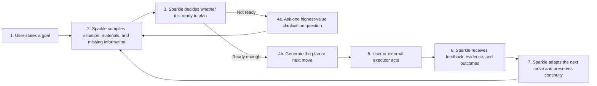
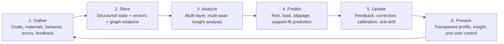
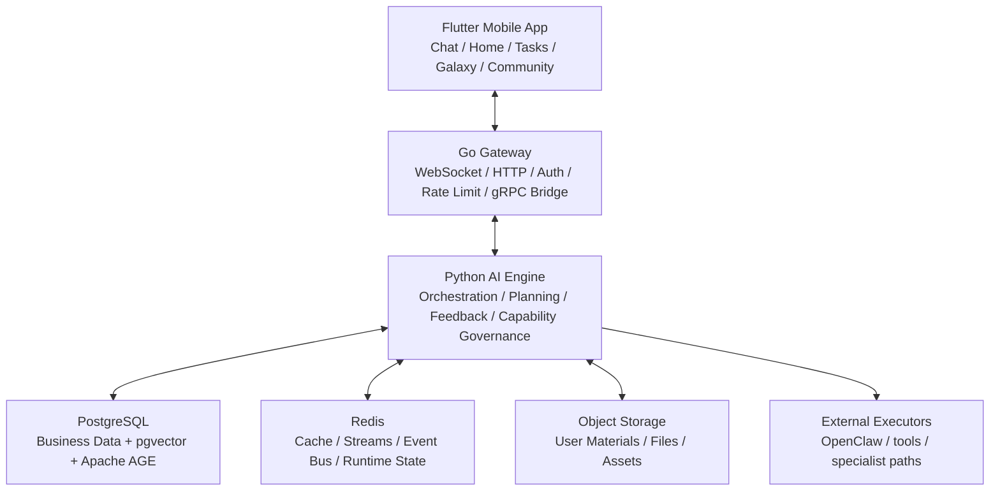
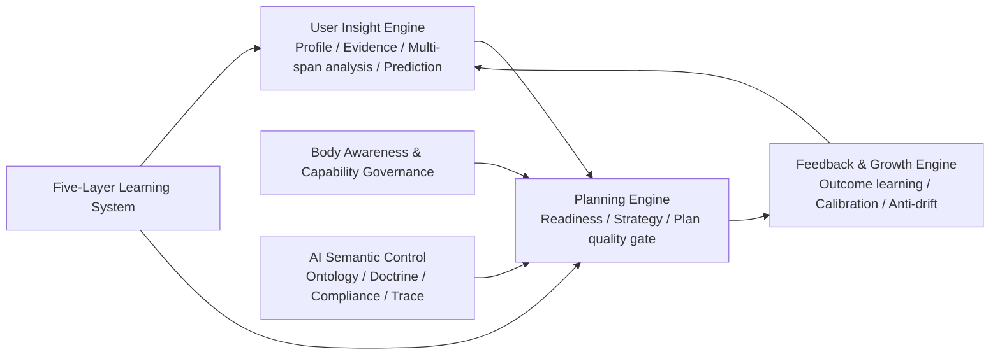

<div align="center">

# Sparkle

### An AI-Native Planning and Growth Operating System

**Sparkle does not ask ordinary users to master prompt engineering. It understands the user first, then turns the user’s own information into better plans, better next moves, and better adaptive guidance.**

[](https://flutter.dev)
[](https://go.dev)
[](https://python.org)
[](https://www.postgresql.org/)
[](LICENSE)

[中文](README.md) · **English** · [Docs](docs/README.md)

</div>

---

## One-Sentence Product Pitch

> **Sparkle is an AI-native planning and guidance operating system that deeply understands ordinary users and turns their own data into better plans, better next moves, and better ongoing adaptation than raw AI alone.**

---

## Where We Are Now

Sparkle is no longer a concept project, and it is not just a multi-agent technology demo.

Its `v1` core is now materially in place:

- the `user profile / insight system` has a canonical compiled backbone
- the `Planning Engine` has readiness gating, strategy compilation, and plan-quality constraints
- the `Feedback / Growth Engine` has outcome learning, calibration, and anti-drift
- the `AI semantic-control system` now has a unified ontology, renderer, compliance layer, and trace
- `Body Awareness` and the `Five-Layer Learning System` are now runtime-governed instead of aspirational

The project is now in `Stage 2`:

- we are no longer trying to endlessly invent new foundational layers
- the focus is now `runnable golden path`
- the focus is now `full-stack product coherence`
- the focus is now `Live Alpha` and `real human validation`

The most honest and strongest description of Sparkle today is:

> **an AI-native product with its core intelligence systems in place, now moving from internal sophistication to real product proof**

---

## The Problem Sparkle Solves

Frontier AI is powerful, but most ordinary users still face three real problems:

1. they do not know what information to give the model
2. they do not know how to turn their own materials, errors, behavior, and constraints into high-quality context
3. even when they get an answer, they struggle to convert it into an executable, adaptive, trustworthy path

Sparkle is not trying to turn users into AI experts.

Sparkle is trying to:

- help users understand themselves better
- help users see their real goal structure and bottlenecks
- turn user-owned data into better plans
- keep adapting after execution, failure, overload, and correction

---

## Who Sparkle Is For

Sparkle is not designed first for AI power users.

It is designed first for people who:

- have important goals but weak AI-operating skill
- have lots of personal materials, errors, notes, and history but do not know how to use them well
- need to find the right path quickly under time pressure
- want long-term growth but lack high-quality external structure and feedback

Typical cases:

- preparing for a final exam in 14 days
- building a study plan from personal materials
- recovering after overload, procrastination, or plan drift
- gradually building a system that actually understands the user over time

---

## The 4 External Product Modes

These are the cleanest product-facing modes to use in a pitch or demo.

| Mode | What the user experiences | What Sparkle is doing under the hood |
|:---|:---|:---|
| `Understand` | Understand who the user is, what they want, and what is still missing | Compile profile, evidence, gaps, and current state |
| `Plan` | Turn the user’s information into the best plan and next move | Evaluate readiness, compile strategy, constrain plan quality |
| `Adapt` | Change the path when reality changes | Read feedback, outcomes, load, materials, and runtime context |
| `Grow` | Improve over time while staying visible and governable | Calibrate, prevent drift, expose insights, accept corrections |

Internally, Sparkle also has chat modes, experience modes, agent routing, and tool routing. But these four modes are the clearest way to explain the product.

---

## Sparkle’s Two Real Moats

Sparkle is not trying to win by “having more models.”

It is trying to win through two real moats:

| Moat | Meaning | What the user feels |
|:---|:---|:---|
| `User Understanding Quality` | Sparkle can surface things the user cannot easily see alone from their goals, materials, behavior, errors, and feedback | “It really understood what was actually blocking me.” |
| `Plan Quality` | Sparkle turns that understanding into a better plan, pacing model, decomposition, and next move | “This plan is more useful than what I would get from raw AI directly.” |

The product standard is simple:

> **Sparkle should understand the user more deeply and plan more intelligently than raw AI use for a non-expert user.**

---

## Raw AI vs Sparkle

| Dimension | Raw AI Direct Use | Sparkle |
|:---|:---|:---|
| Context organization | The user does the prompt engineering | The system actively detects gaps and compiles context |
| User understanding | Mostly limited to the current turn | Built on a persistent `UserInsightState` |
| Plan quality | Often a generic answer or generic plan | Readiness-gated, strategy-driven, grounded planning |
| Feedback learning | Mostly turn-level satisfaction | Outcome learning, calibration, and anti-drift |
| Transparency | Users rarely see how the system models them | Users can inspect, correct, and control their insight state |
| Continuity | Usually session-local | Designed for cross-session improvement and continuity |

---

## The Core Product Loop



This is not a one-shot answer system. It is an evolving planning loop.

---

## The Core Data-Utilization Loop

Sparkle’s core principle is not “collect more data.”

It is **use the user’s own data more deeply, more accurately, and more transparently**.



This six-part loop is one of Sparkle’s deepest advantages:

- not just memory
- but utilization
- not just utilization
- but explainable, correctable utilization

---

## The Technical Design That Matters Most

### 1. User Insight and Profile System

Sparkle does not re-guess the user from scratch on every turn.

It compiles user-owned information into a canonical `UserInsightState` that supports:

- goal and constraint understanding
- current-state and bottleneck detection
- multi-span analysis
- bounded prediction
- transparency and user correction

This is the substrate that makes “understanding the user” real.

### 2. Planning Engine

Sparkle is designed not to politely hallucinate plans.

Before planning, it checks:

- whether the system is ready enough to plan
- whether it should clarify first
- whether it should only offer a provisional plan
- whether it must explicitly ground itself in user materials

Then it enforces plan quality instead of treating generation as final truth.

### 3. AI Semantic Control

Sparkle does not rely on opaque control tags alone.

We built:

- a canonical strategy ontology
- a shared doctrine renderer
- behavior-level semantic compliance checks
- traceable semantic-control metadata

This makes the AI system better at following product intent instead of guessing what a label means.

### 4. Feedback, Growth, and Anti-Drift

Sparkle does not only ask whether the user liked a sentence.

It keeps learning:

- which plans worked
- which strategies failed
- what the user corrected about the system’s profile
- which inferred signals became stale or should be scoped

And it responds with:

- confidence calibration
- ineffective-signal pruning
- scope control
- drift prevention

### 5. Transparency and User Control

One of Sparkle’s core principles is:

> **users should be able to see how the system understands them, and they should have the right to correct it**

So the system supports:

- visible insight / prediction / unknowns
- visible calibration state
- `wrong`
- `used_to_be_true`
- `exam_mode_only`
- `reset_override`

That is one of the strongest differences between Sparkle and many large-model products.

---

## System Architecture Overview



### Inside the AI Engine



These diagrams are the clearest README-level explanation of the system.

---

## The Best Parts of the Design

If we had to summarize Sparkle’s strongest design decisions, they would be:

1. **A canonical user understanding state instead of scattered profile fragments**
2. **Ask-before-plan discipline instead of polite guessing**
3. **Semantic AI control instead of opaque prompt tags**
4. **Outcome learning with governance and anti-drift**
5. **Visible profile transparency and user correction**
6. **A convergent architecture built around two moats: understanding quality and plan quality**

---

## North-Star Scenario

The best scenario for demonstrating Sparkle remains:

### Thermodynamics Final in 14 Days

The user:

- uploads slides, notes, homework, and prior errors
- has a real exam in 14 days
- does not fully understand their own bottleneck
- becomes overloaded partway through

Sparkle should:

- figure out what is still missing
- ground itself in the user’s real materials
- produce a good plan
- visibly adapt when pressure or failure appears
- preserve continuity and trust across time

That is the scenario where the product should visibly beat raw AI usage.

---

## The Most Important Product Goal Right Now

The most important question is no longer “do we have enough modules?”

The most important question now is:

> **Can Sparkle run as a real product and clearly outperform ordinary raw-AI use for a non-expert user?**

That is why Stage 2 is focused on:

- a runnable golden path
- real in-app experience
- first human-evaluation cycles and transcript review
- judging value through real product behavior, not only synthetic scores

---

## Quick Start

### Prerequisites

| Dependency | Version |
|:---|:---|
| Go | 1.22+ |
| Python | 3.11+ |
| Flutter | 3.24+ |
| Docker / Docker Compose | 24+ / 2.x |

### Local Bring-Up

```bash
# 1. Clone the repository
git clone https://github.com/BRSAMAyu/Sparkle-project.git
cd Sparkle-project

# 2. Configure environment variables
cp backend/.env.example backend/.env
cp backend/gateway/.env.example backend/gateway/.env

# 3. Start infrastructure
make dev-up

# 4. Sync database and generate code
make sync-db
make proto-gen

# 5. Start the Python AI engine
make grpc-server

# 6. Start the Go gateway
make gateway-dev

# 7. Run the mobile app
cd mobile && flutter run
```

### Common Commands

```bash
make dev-up
make grpc-server
make gateway-dev
make proto-gen
make sync-db

cd backend && pytest
cd backend/gateway && go test ./...
cd mobile && flutter test
```

---

## Repository Structure

```text
Sparkle-project/
├── mobile/                  # Flutter client
├── backend/app/             # Python AI engine
├── backend/gateway/         # Go gateway
├── proto/                   # gRPC protocol definitions
├── docs/                    # product, architecture, and verification docs
├── scripts/                 # startup, verification, and utility scripts
└── docker-compose.yml       # local infrastructure
```

---

## Key Documents

- [Docs Entry](docs/README.md)
- [Product Thesis and Refocused Roadmap](docs/product/SPARKLE_PRODUCT_THESIS_AND_REFOCUSED_ROADMAP_2026-04-05.md)
- [Stage 2 Product Coherence and Live Alpha Plan](docs/product/SPARKLE_STAGE2_PRODUCT_COHERENCE_AND_LIVE_ALPHA_PLAN_2026-04-06.md)
- [Stage 2 Product Coherence Execution Plan](docs/product/implementation/SPARKLE_STAGE2_PRODUCT_COHERENCE_EXECUTION_PLAN_2026-04-06.md)
- [Stage 2 Profile and Insight System Plan](docs/product/implementation/SPARKLE_STAGE2_PROFILE_AND_INSIGHT_SYSTEM_EXECUTION_PLAN_2026-04-06.md)
- [AI Semantic Control Plan](docs/product/implementation/SPARKLE_AI_SYSTEM_SEMANTIC_CONTROL_EXECUTION_PLAN_2026-04-06.md)
- [Data Utilization Analysis](docs/product/SPARKLE_DATA_UTILIZATION_ANALYSIS_2026-04-06.md)

---

## Current Position

The most accurate description of Sparkle right now is not “a giant AI platform.”

It is:

> **an AI-native planning and growth operating system with its core intelligence systems in place, now moving into real product proof**

That is the consensus this repository should communicate.

---

## License

This project is licensed under the [MIT License](LICENSE).
