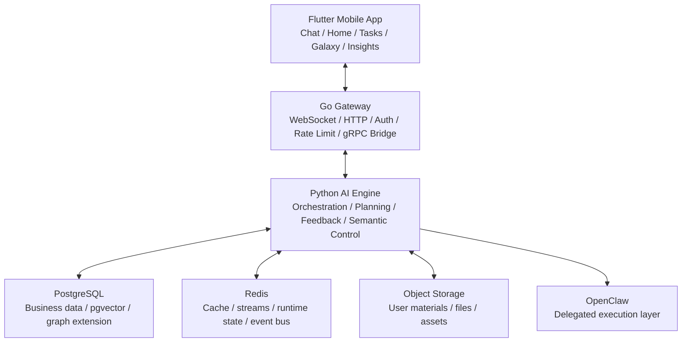

<div align="center">

# Sparkle

### An AI-Native Learning and Growth System

**Sparkle is not built around teaching ordinary users prompt engineering first. It is built to understand the user first, then turn the user’s own information into better plans, better next moves, and better long-term adaptation.**

[](https://flutter.dev)
[](https://go.dev)
[](https://python.org)
[](https://www.postgresql.org/)


[中文](README.md) · **English** · [Docs](docs/README.md)

</div>

---

## What Sparkle Is

Sparkle now has a tighter signed definition:

> **Sparkle is an AI learning and growth system.**

In its short-term product form, Sparkle can be understood as an AI learning coach. In its long-term form, it becomes an AI growth operating system. These are not two separate products. They are two points on the same curve.

Sparkle’s core job is not “chatting better.” Its job is to turn a user’s goals, materials, constraints, behavior, mistakes, and feedback into a durable understanding state, then use that state to generate more grounded plans, better pacing, and better next moves.

---

## Why It Matters

Frontier AI is already powerful, but ordinary users still get stuck in three predictable places:

1. they do not know what information to give the model
2. they do not know how to turn their own materials, behavior, mistakes, and constraints into high-quality context
3. even when they get an answer, they struggle to convert it into an executable, adaptive, trustworthy path

Sparkle is not trying to turn users into AI experts. It is trying to take on the system work of understanding, structuring, planning, and adapting on the user’s behalf.

The clearest north-star scenario is still:

> **preparing for a thermodynamics final in 14 days**

In that scenario, Sparkle should not just answer questions. It should understand the user’s real situation, identify what is still missing, build the plan, and visibly adapt after overload, drift, failure, or correction.

---

## How It Understands the User

The cleanest product-facing framing for Sparkle is still four modes:

| Mode | What the user sees | What the system is doing |
|:---|:---|:---|
| `Understand` | Clarify who the user is, what they want, and what is still missing | Compile profile, evidence, gaps, and current state |
| `Plan` | Generate the best plan, pacing model, and next move | Evaluate readiness, compile strategy, and constrain plan quality |
| `Adapt` | Change the path when reality changes | Read feedback, outcomes, load, materials, and execution state |
| `Grow` | Improve over time while remaining visible and correctable | Calibrate, prevent drift, expose insights, and accept correction |

Under that product layer, Sparkle is now anchored by three more stable ideas:

- `Dual-core collaboration`: the execution core handles clarification, sufficiency, planning, and adjustment; the cognitive core handles profile, memory, motivation/state understanding, and durable companionship. The two cores must cooperate rather than drift into parallel silos.
- `Five-layer user model`: raw evidence, projection, inference, Aurora shadow, and user correction are handled as distinct layers so that inferred understanding does not silently overwrite factual state.
- `Relationship stance`: Sparkle is not just prompt engineering wrapped in UI, and not just an “assistant persona.” It is designed to be calibratable, correctable, and companion-like while preserving independent judgment.

---

## Why Sparkle Is Different

Sparkle’s moat still converges on two things:

| Moat | Meaning | What the user feels |
|:---|:---|:---|
| `User Understanding Quality` | The system can surface things the user cannot easily see alone from their own goals, materials, behavior, mistakes, and feedback | “It actually understood what was blocking me.” |
| `Plan Quality` | The system converts that understanding into a more useful plan, pacing model, decomposition, and next move | “This plan is better than what I would get from raw AI directly.” |

Compared with raw AI use:

| Dimension | Raw AI Direct Use | Sparkle |
|:---|:---|:---|
| Context organization | The user does the prompt engineering | The system actively detects gaps and compiles context |
| User understanding | Mostly constrained to the current turn | Built on a persistent understanding state and evidence chain |
| Planning quality | Usually a generic answer or generic plan | Readiness-gated, grounded, strategy-driven planning |
| Feedback learning | Mostly turn-level satisfaction | Outcome learning, calibration, and anti-drift |
| Transparency | Users rarely see how the system models them | Users can inspect, correct, and govern their insight state |
| Continuity | Usually session-local | Designed for cross-session, cross-stage improvement |

---

## Architecture

Sparkle is still a three-layer system: `Flutter Mobile + Go Gateway + Python AI Engine`, backed by PostgreSQL, Redis, object storage, and an external execution layer.



### Why the system is shaped this way

| Component | Role | Why it exists |
|:---|:---|:---|
| `Flutter Mobile` | Product surface | Hosts the real user experience: chat, home, tasks, galaxy, insights |
| `Go Gateway` | Access and bridge layer | Handles WebSocket / HTTP ingress, auth, connection governance, and gRPC bridging |
| `Python AI Engine` | Intelligence core | Owns context compilation, planning, tool use, feedback learning, and semantic control |
| `FastAPI` | Business API layer | Serves resource APIs, files, settings, interventions, observability, and operational surfaces |
| `gRPC AgentService` | Main AI transport | Carries the primary streaming AI path between the Gateway and the orchestrator |
| `PostgreSQL` | Core data source | Stores users, tasks, plans, feedback, knowledge state, and other durable product data |
| `Redis` | Runtime and event layer | Supports cache, streams, event bus, runtime state, and parts of state synchronization |
| `Object Storage / MinIO` | Material and file layer | Stores user-uploaded materials, files, and assets |
| `OpenClaw` | External execution layer | Handles delegated execution tasks, but is not the product definition of Sparkle itself |

### Main product request path

The primary product chat path is not direct Python HTTP. It is:

`Flutter -> /ws/chat -> Go Gateway -> gRPC AgentService -> Python ChatOrchestrator`

In practice:

1. the Flutter app opens the main chat WebSocket to the Gateway
2. the Go Gateway handles connection lifecycle, auth, protocol shaping, and request governance
3. the Gateway calls Python `AgentService.StreamChat`
4. the Python `ChatOrchestrator` compiles context, selects strategy, invokes tools, and streams results
5. results flow back through the Gateway to the app as text, cards, tool results, and intervention expressions

---

## Current Status

Sparkle is no longer a concept project, and it is not just a multi-agent demo.

As of `2026-04-24`, the repo-backed mainline status is:

- the document chain, implementation chain, and executable verification chain for `Stage 3-40` are closed out
- the `Phase I Exit Gate` has been signed off with `ready with exception / YES`
- `Rule BD` remains `CONDITIONAL` because SGW live dogfood still depends on a full backend stack, so this is not described as unconditional readiness

The homepage can safely cite these repo-backed metrics:

| Metric | Current status | Source |
|:---|:---|:---|
| `scripts/run_all_rule_guards.sh` | `59/59 PASS` | `docs/audit/STAGE3_40_FULL_CLOSEOUT_VERIFICATION_2026-04-24.md` |
| core kill switch tri-state completion | `12/12` | `docs/product/SPARKLE_AURORA_PHASE_I_EXIT_GATE_2026-04-22.md` |
| mobile black-hole rate | `0.000%` | `docs/product/SPARKLE_AURORA_STAGE35_HANDOFF_2026-04-22.md` |
| top-50 hot files Core/Phase header coverage | `100%` | `docs/product/SPARKLE_AURORA_PHASE_I_EXIT_GATE_2026-04-22.md` |

The most accurate description of Sparkle today is:

> **Sparkle has moved out of the “core concept buildout” phase and into a stage where governance closure is in place and RL tuning / real-runtime optimization are the next priorities.**

---

## Recent Stage Progress

This README does not list every stage as a changelog, but from `Stage 22` through `Stage 40`, the mainline now has several clear capability closures.

### Stage 22-23: visible context, loop closure, and synthetic baselines

- prompt coverage auditing was established, and read-visible context such as `achievement_summary` and `calendar_context` was wired into the main path
- the `error -> replan -> verify -> learn` loop was repaired so error-driven adaptation no longer runs through a leaky chain
- seed adoption / withdrawal, outcome backfill, and source-state registry were closed as explicit system paths
- Stage 23 added synthetic density bootstrap: 3 synthetic users with 150 decision→outcome pairs each for Bayesian and downstream strategy evaluation

### Stage 24-35: real wiring across strategy, cognition, and mobile

- policy, reflection, scene, foresight, SRL, metacognition, and mobile parity were wired into the mainline
- states such as `working_memory_snapshot`, `achievement_summary`, `active_skills_summary`, `engagement_state`, and `foresight_hint` now exist in the real chain rather than only in planning docs
- mobile parity was elevated into governance so user-state consumption and backend-only boundaries are explicitly tracked

### Stage 34-40: governance, drills, and Exit Gate closure

- event subscribers, journey smoke, context assembly, and more prompt-visible state were wired in
- kill switch tri-state control, guard manifest closure, calendar prompt kill switch, drill playbooks, and consolidated drills were completed
- the Phase I Exit Gate was closed, and the Phase II RL direction was frozen as an executable handoff rather than an open-ended idea

Authoritative entry points:

- [Vision Anchor List](docs/product/SPARKLE_VISION_ANCHOR_LIST_2026-04-19.md)
- [Stage 40 Handoff](docs/product/SPARKLE_AURORA_STAGE40_HANDOFF_2026-04-22.md)
- [Stage 40 Main Integration Report](docs/audit/STAGE40_MAIN_INTEGRATION_REPORT_2026-04-23.md)
- [Phase I Exit Gate](docs/product/SPARKLE_AURORA_PHASE_I_EXIT_GATE_2026-04-22.md)
- [SGW v2 RL System Handoff](docs/sgw/07_rl_system_handoff.md)

---

## Simulation / Evaluation / RL Scaffolding

The repo now contains more than stage documents. It contains a real scaffolding layer for simulation, evaluation, and RL readiness.

### Data and synthetic inputs

- Stage 23 provides synthetic density bootstrap that generates synthetic users and decision→outcome pairs
- the seed library, source-state registry, and outcome backfill now form a traceable input and feedback loop
- this layer exists to support repeatable strategy evaluation, behavior validation, and later RL optimization, not just demo data generation

### Interaction and evaluation

- the repo includes a `Soul Drift Evaluation Harness` for distinguishing governed companion growth from stylized personality drift
- it also includes a `Phase D Evaluation Harness` for body-aware selection, fallback reporting, and blocked-organ simulation regression
- the mainline is paired with `journey smoke`, stage drill scripts, and global rule guards for continuous product-path and governance verification

### RL readiness

- SGW v2 already supports `off / shadow / rl`
- the RL CLI contract, metrics, rollout gates, and rollback red lines are frozen in the handoff docs
- Phase II is explicitly scoped around optimizing the existing loops rather than expanding the feature surface

The README boundary is deliberate:

- it is accurate to say that RL scaffolding and the Phase II entry credential are in place
- it is not accurate to say that RL has already been fully rolled out in real production

---

## Quick Start

The main development path is still a local three-layer workflow: `Flutter + Go Gateway + Python AI Engine`.

### Shortest bring-up path

```bash
cp .env.example .env
cp backend/.env.example backend/.env
cp backend/gateway/.env.example backend/gateway/.env

make dev-up
make sync-db
make proto-gen
```

Then start the main services in separate terminals:

```bash
make grpc-server
make gateway-dev
cd mobile && flutter pub get && flutter run
```

### What each main command does

| Command | Purpose |
|:---|:---|
| `make dev-up` | Starts PostgreSQL, Redis, MinIO, and other base infrastructure |
| `make sync-db` | Applies migrations and syncs the Go-side database schema / SQLC code |
| `make proto-gen` | Regenerates protobuf / gRPC code |
| `make grpc-server` | Starts the Python gRPC AI engine |
| `make gateway-dev` | Starts the Go Gateway in development mode |

### Common development commands

| Command | Use case |
|:---|:---|
| `make dev-all` | Prints the full bring-up guide |
| `make api-server` | Starts the Python FastAPI business API |
| `cd backend && pytest` | Runs Python tests |
| `cd backend/gateway && go test ./...` | Runs Go tests |
| `cd mobile && flutter test` | Runs Flutter tests |

### Governance and mainline verification

If you want to validate the current governed mainline, start with:

- `scripts/run_all_rule_guards.sh`
  for global rule, guard, and governance regression checks
- `scripts/stage40/drill_all.sh`
  for Stage 40 kill-switch and mainline closure drills

---

## Repository Guide

| Path | What it holds | When to read it |
|:---|:---|:---|
| `mobile/` | Flutter client and real product UX | When working on user flows, screens, and interaction |
| `backend/app/` | Python AI engine, FastAPI, orchestration, and state systems | When working on intelligence, planning, feedback, or APIs |
| `backend/gateway/` | Go Gateway, WebSocket / HTTP ingress, gRPC bridge | When working on the main chat path, auth, or connection lifecycle |
| `proto/` | gRPC protocol definitions | When changing cross-service contracts |
| `docs/product/` | roadmap, handoff docs, vision anchor, stage consensus | When making product or stage-state judgments |
| `docs/audit/` | Stage 40 integration, mainline recovery, closeout verification | When tracing what is currently verified on the mainline |
| `docs/sgw/` | SGW, MDP, rollout gates, RL handoff | When working on simulation, evaluation, or RL |
| `scripts/stage*/` | stage gates, drills, dogfood scripts, rule guards | When executing stage verification |
| `docs/README.md` | main docs entry point | When entering the repo for the first time |

---

## Further Reading

- [Docs Entry](docs/README.md)
- [Vision Anchor List](docs/product/SPARKLE_VISION_ANCHOR_LIST_2026-04-19.md)
- [Stage 3-40 Full Closeout Verification](docs/audit/STAGE3_40_FULL_CLOSEOUT_VERIFICATION_2026-04-24.md)
- [Roadmap Implementation Verification](docs/audit/ROADMAP_IMPLEMENTATION_VERIFICATION_2026-04-24.md)
- [Stage 40 Main Integration Report](docs/audit/STAGE40_MAIN_INTEGRATION_REPORT_2026-04-23.md)
- [Phase I Exit Gate](docs/product/SPARKLE_AURORA_PHASE_I_EXIT_GATE_2026-04-22.md)
- [Phase II RL Optimization Kickoff](docs/product/SPARKLE_AURORA_PHASE_II_RL_OPTIMIZATION_KICKOFF_2026-04-22.md)
- [SGW v2 RL System Handoff](docs/sgw/07_rl_system_handoff.md)

---

## License

This project is currently maintained under the MIT License.
