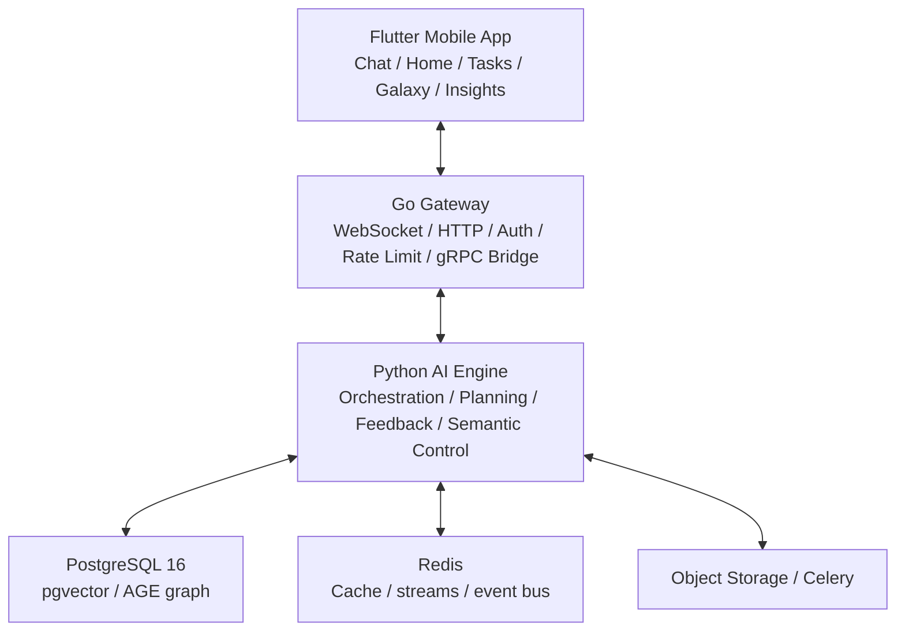

<div align="center">

# Sparkle

### An AI-Native Learning and Growth System

**Sparkle doesn't ask users to learn prompt engineering first. It understands the user first, then turns their own information into better plans, better next steps, and longer-term adaptive support.**

[](https://flutter.dev)
[](https://go.dev)
[](https://python.org)
[](https://www.postgresql.org/)


[Chinese](README.md) · **English**

</div>

---

## What Sparkle Is

> **Sparkle is an AI learning and growth system** — an AI learning coach in the short term, evolving toward a growth operating system in the long term.

Instead of "chatting more rounds", Sparkle organizes a user's goals, materials, constraints, behaviors, mistakes, and feedback into a continuously evolving understanding state, then uses that state to produce better-grounded plans, sustainable rhythm, and the right next step.

## Why It Matters

Modern LLMs are powerful, yet ordinary users still get stuck on real goals:

1. Not knowing what information to give the AI.
2. Not knowing how to organize materials, behaviors, errors, and constraints into high-quality context.
3. Struggling to turn answers into an executable, sustainable, self-correcting path.

Sparkle takes over this "understand — organize — plan — adapt" systems work.

## How It Understands the User

| Mode | What users see | What the system does |
|:---|:---|:---|
| `Understand` | Figures out who you are, what you want, what's missing | Compiles profile, evidence, gaps, current state |
| `Plan` | The best plan, rhythm, and next step | Assesses readiness, compiles strategy, constrains plan quality |
| `Adapt` | The path changes as reality changes | Reads feedback, outcomes, load, materials, execution state |
| `Grow` | Knows you better over time — visibly and correctably | Calibration, anti-drift, transparency, user control |

## Architecture



**Main request path**: `Flutter → /ws/chat → Go Gateway → gRPC AgentService → Python ChatOrchestrator`

## Quick Start

```bash
cp .env.example .env && cp backend/.env.example backend/.env && cp backend/gateway/.env.example backend/gateway/.env
make dev-up && make sync-db && make proto-gen
make grpc-server     # terminal 1
make gateway-dev     # terminal 2
cd mobile && flutter run   # terminal 3
```

Tests: `cd backend && pytest` | `cd backend/gateway && go test ./...` | `cd mobile && flutter test`

## Repository Map

| Path | Contents |
|:---|:---|
| `mobile/` | Flutter client |
| `backend/app/` | Python AI engine, FastAPI, orchestration, state systems |
| `backend/gateway/` | Go gateway |
| `proto/` | gRPC contracts (single source of truth) |
| `docs/` | Engineering docs ([entry](docs/README.md)) |
| `docs/competition/` | Competition materials |
| `docs/engineering/` | Standards, repo hygiene rules, known code debt ledger |
| `scripts/` | Governance guards and tooling |

## Further Reading

- [Docs entry](docs/README.md) · [Agent deep guide](docs/00_项目概览/05_编码代理深度指南.md) · [Repo standards](docs/engineering/REPOSITORY_STANDARDS.md)

---

## License

MIT License.
