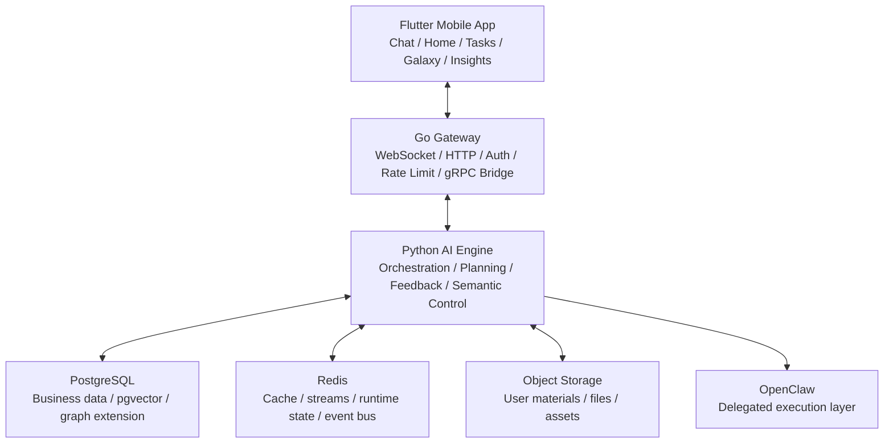
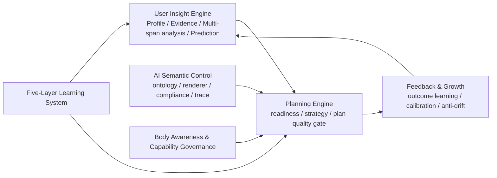

<div align="center">

# Sparkle

### An AI-Native Planning and Growth Operating System

**Sparkle is built for people who should not have to master prompt engineering first. It understands the user, then turns the user’s own information into better plans, better next moves, and better long-term adaptation.**

[](https://flutter.dev)
[](https://go.dev)
[](https://python.org)
[](https://www.postgresql.org/)
[](LICENSE)

[中文](README.md) · **English** · [Docs](docs/README.md)

</div>

---

## What Sparkle Is

Sparkle is an **AI-native planning and guidance system**. Its core job is not just to chat. Its job is to turn a user’s goals, materials, constraints, behavior, mistakes, and feedback into a durable understanding state, then use that state to produce better plans, better pacing, and better next moves.

In one sentence:

> **Sparkle understands the user first, then gives the user a better path.**

---

## Why It Matters

Frontier AI is already powerful, but ordinary users still run into three persistent problems:

1. they do not know what information to give the model
2. they do not know how to turn their own materials, behavior, mistakes, and constraints into high-quality context
3. even when they get an answer, they struggle to convert it into an executable, adaptive, trustworthy path

Sparkle is not trying to turn users into AI experts. It is trying to take on the system work of understanding, structuring, planning, and adapting on the user’s behalf.

---

## Who It Is For

Sparkle is not designed first for power users who already know how to operate frontier models well.

It is designed first for people who:

- have important goals but weak AI-operating skill
- have a lot of their own materials, notes, and mistakes, but do not know how to turn them into better decisions
- need to find the right path under time pressure
- want long-term growth but lack strong external structure and feedback loops

The clearest north-star scenario remains:

> **preparing for a thermodynamics final in 14 days**

In that scenario, Sparkle should not just answer questions. It should understand the user’s real state, identify what is still missing, build the plan, and visibly adapt after overload, drift, failure, or correction.

---

## How Sparkle Works

The cleanest product-facing framing for Sparkle is four modes:

| Mode | What the user sees | What the system is doing |
|:---|:---|:---|
| `Understand` | Clarify who the user is, what they want, and what is still missing | Compile profile, evidence, gaps, and current state |
| `Plan` | Generate the best plan, pacing model, and next move | Evaluate readiness, compile strategy, and constrain plan quality |
| `Adapt` | Change the path when reality changes | Read feedback, outcomes, load, materials, and execution state |
| `Grow` | Improve over time while remaining visible and correctable | Calibrate, prevent drift, expose insights, and accept correction |

That is why Sparkle should be read as a continuous planning loop, not a one-shot answer engine.

---

## Why Sparkle Is Different

Sparkle is not trying to win by “having more models.” It is trying to win through two real moats:

| Moat | Meaning | What the user feels |
|:---|:---|:---|
| `User Understanding Quality` | The system can surface things the user cannot easily see alone from their own goals, materials, behavior, mistakes, and feedback | “It actually understood what was blocking me.” |
| `Plan Quality` | The system converts that understanding into a more useful plan, pacing model, decomposition, and next move | “This plan is better than what I would get from raw AI directly.” |

Compared with raw AI use:

| Dimension | Raw AI Direct Use | Sparkle |
|:---|:---|:---|
| Context organization | The user does the prompt engineering | The system actively detects gaps and compiles context |
| User understanding | Mostly constrained to the current turn | Built on a persistent `UserInsightState` |
| Planning quality | Usually a generic answer or generic plan | Readiness-gated, grounded, strategy-driven planning |
| Feedback learning | Mostly turn-level satisfaction | Outcome learning, calibration, and anti-drift |
| Transparency | Users rarely see how the system models them | Users can inspect, correct, and govern their insight state |
| Continuity | Usually session-local | Designed for cross-session continuity and improvement |

---

## Architecture

Sparkle is currently a three-layer system: `Flutter Mobile + Go Gateway + Python AI Engine`, backed by PostgreSQL, Redis, object storage, and an external execution layer.



### Why the system is shaped this way

| Component | Role | Why it exists |
|:---|:---|:---|
| `Flutter Mobile` | Product surface | Hosts the real user experience: chat, home, tasks, galaxy, insights |
| `Go Gateway` | Access and bridge layer | Handles WebSocket / HTTP ingress, auth, connection governance, and gRPC bridging |
| `Python AI Engine` | Intelligence core | Owns context compilation, planning, tool use, feedback learning, and semantic control |
| `FastAPI` | Business API layer | Serves resource APIs, files, settings, interventions, observability, and operational surfaces |
| `gRPC AgentService` | Main AI transport | Carries the primary streaming AI path between the Gateway and the orchestrator |
| `PostgreSQL` | Core data source | Stores users, tasks, plans, feedback, knowledge state, and other durable product data |
| `Redis` | Runtime and event layer | Supports cache, streams, event bus, runtime state, and parts of state synchronization |
| `Object Storage / MinIO` | Material and file layer | Stores user-uploaded materials, files, and assets |
| `OpenClaw` | External execution layer | Handles delegated execution tasks, but is not the product definition of Sparkle itself |

### Main product request path

The primary product chat path is not direct Python HTTP. It is:

`Flutter -> /ws/chat -> Go Gateway -> gRPC AgentService -> Python ChatOrchestrator`

In practice:

1. the Flutter app opens the main chat WebSocket to the Gateway
2. the Go Gateway handles connection lifecycle, auth, protocol shaping, and request governance
3. the Gateway calls Python `AgentService.StreamChat`
4. the Python `ChatOrchestrator` compiles context, selects strategy, invokes tools, and streams results
5. results flow back through the Gateway to the app as text, cards, tool results, and intervention expressions

### Inside the AI engine



That internal backbone is the heart of Sparkle:

- the `User Insight Engine` compiles user-owned information into a usable understanding state
- the `Planning Engine` decides whether the system is ready to plan, how it should plan, and whether the plan is good enough
- `Feedback & Growth` binds outcomes and corrections back into the next cycle
- `Semantic Control` constrains model behavior around product intent instead of relying on opaque tags alone
- `Body Awareness` and the `Five-Layer Learning System` inject capability limits, load awareness, and long-range learning governance back into the loop

---

## Current Stage

Sparkle is no longer a concept project, and it is not just a multi-agent demo.

Its `v1` core is now materially in place:

- `User Profile / Insight` has a canonical compiled backbone
- the `Planning Engine` has readiness gating, strategy compilation, and plan-quality control
- `Feedback / Growth` has outcome learning, calibration, and anti-drift
- `AI Semantic Control` now has ontology, rendering, compliance, and trace
- `Body Awareness` and the `Five-Layer Learning System` are now runtime-governed rather than aspirational

The project is now in `Stage 2`. The priority is no longer inventing more foundational layers. The priority is:

- establishing a runnable golden path
- improving full-stack product coherence
- proving understanding quality and plan quality in the real app
- using real transcripts, real feedback, and real human evaluation to drive the next iteration

The most accurate description of Sparkle today is:

> **an AI-native product with its core intelligence systems in place, now moving from internal sophistication to real product proof**

---

## Quick Start

### Shortest bring-up path

```bash
cp .env.example .env
cp backend/.env.example backend/.env
cp backend/gateway/.env.example backend/gateway/.env

make dev-up
make sync-db
make proto-gen
```

Then start the main services in separate terminals:

```bash
make grpc-server
make gateway-dev
cd mobile && flutter pub get && flutter run
```

### What each main command does

| Command | Purpose |
|:---|:---|
| `make dev-up` | Starts PostgreSQL, Redis, MinIO, and other base infrastructure |
| `make sync-db` | Applies migrations and syncs the Go-side database schema / SQLC code |
| `make proto-gen` | Regenerates protobuf / gRPC code |
| `make grpc-server` | Starts the Python gRPC AI engine |
| `make gateway-dev` | Starts the Go Gateway in development mode |

### Common development commands

| Command | Use case |
|:---|:---|
| `make dev-all` | Prints the full bring-up guide |
| `make api-server` | Starts the Python FastAPI business API |
| `cd backend && pytest` | Runs Python tests |
| `cd backend/gateway && go test ./...` | Runs Go tests |
| `cd mobile && flutter test` | Runs Flutter tests |

---

## Repository Guide

| Path | What it holds | When to read it |
|:---|:---|:---|
| `mobile/` | Flutter client and real product UX | When working on user flows, screens, and interaction |
| `backend/app/` | Python AI engine, FastAPI, orchestration, and state systems | When working on intelligence, planning, feedback, or APIs |
| `backend/gateway/` | Go Gateway, WebSocket / HTTP ingress, gRPC bridge | When working on the main chat path, auth, or connection lifecycle |
| `proto/` | gRPC protocol definitions | When changing cross-service contracts |
| `docs/product/` | Current product consensus, roadmap, and Stage 2 planning | When making product or strategy judgments |
| `docs/02_技术设计文档/` | APIs, protocol references, database and technical design docs | When changing architecture, interfaces, or data models |
| `docs/README.md` | Main docs entry point | When entering the codebase for the first time |

---

## Further Reading

- [Docs Entry](docs/README.md)
- [Sparkle Product Thesis and Refocused Roadmap](docs/product/SPARKLE_PRODUCT_THESIS_AND_REFOCUSED_ROADMAP_2026-04-05.md)
- [Sparkle ChatGPT Project Context Master](docs/product/SPARKLE_CHATGPT_PROJECT_CONTEXT_MASTER_2026-04-16.md)
- [Stage 2 Product Coherence and Live Alpha Plan](docs/product/SPARKLE_STAGE2_PRODUCT_COHERENCE_AND_LIVE_ALPHA_PLAN_2026-04-06.md)
- [System Architecture Overview](docs/00_项目概览/04_系统架构全景与模块分层.md)
- [API Reference](docs/02_技术设计文档/03_API参考.md)

---

## License

This project is licensed under the [MIT License](LICENSE).
