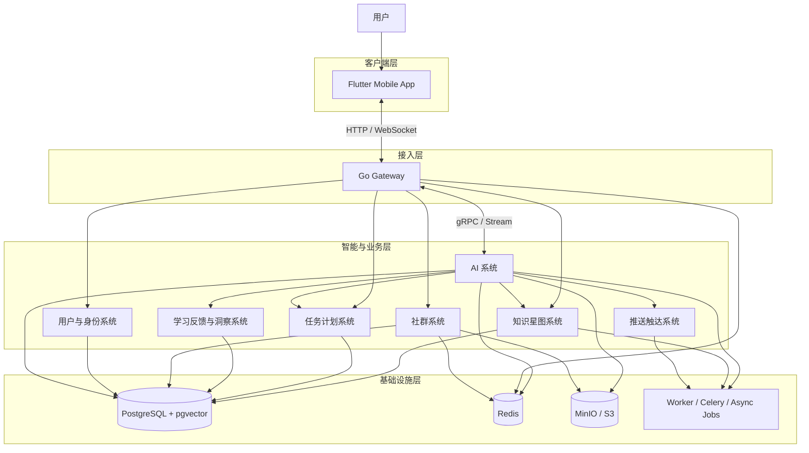
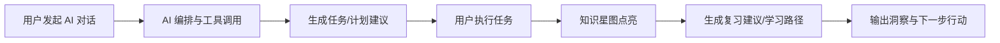
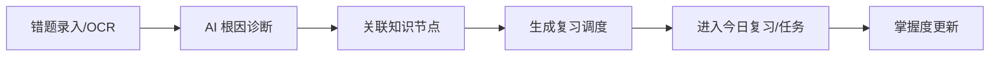
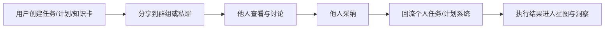

# 系统架构全景与模块分层

更新时间：2026-03-31  
适用对象：产品负责人、架构设计、研发、测试、交付与验收人员。

## 1. 文档目标

本文档从“业务系统”而不是单纯“技术栈”视角，统一说明 Sparkle 当前全系统架构、模块边界、关键数据流和跨系统联动关系，便于：

- 快速理解系统全貌
- 明确各功能模块归属
- 统一系统验收分层口径
- 为后续 PRD、测试、交付文档提供母版

---

## 2. 全系统架构总览

Sparkle 当前可以拆成两套视角：

- 技术视角：`Flutter Mobile` + `Go Gateway` + `Python AI Engine` + `PostgreSQL/Redis/MinIO`
- 业务视角：用户与身份、AI 系统、知识星图系统、任务计划系统、学习反馈与洞察系统、社群系统、推送触达系统、平台支撑系统

---

## 3. 业务系统分层图

| 系统层 | 系统名称 | 核心目标 | 主要承载位置 |
|---|---|---|---|
| L1 | 用户与身份系统 | 认证、资料、权限、偏好、账户上下文 | Go Gateway + PostgreSQL + Mobile |
| L1 | AI 系统 | 对话、编排、工具调用、记忆、专家协作、多模态输入 | Python AI Engine + Proto + Mobile |
| L1 | 知识星图系统 | 知识节点、掌握度、关系图谱、搜索、复习、拓展 | Gateway + AI Engine + PostgreSQL/pgvector |
| L1 | 任务计划系统 | 任务、专注、短期冲刺、长期成长、执行闭环 | Gateway + AI Engine + Mobile |
| L1 | 学习反馈与洞察系统 | 错题诊断、学习路径、认知画像、胶囊/洞察结果 | AI Engine + Gateway + Mobile |
| L1 | 社群系统 | 好友、群组、群聊、私聊、打卡、共享与采纳 | Gateway + Python Community API + Mobile |
| L1 | 推送触达系统 | 智能提醒、通知中心、触达节律控制 | AI Engine + Gateway + Worker |
| L1 | 平台支撑系统 | 协议、数据、缓存、对象存储、异步任务、安全与运维 | Proto + DB + Redis + MinIO + Scripts |

---

## 4. 各系统架构与模块拆分

## 4.1 用户与身份系统

### 系统职责

- 用户注册、登录、JWT/刷新令牌
- 用户资料管理
- 用户偏好、时区、语言、等级等上下文供其他系统复用
- 作为任务、社群、星图、AI 的统一身份锚点

### 模块拆分

| 模块 | 核心职责 | 关键功能 |
|---|---|---|
| 认证模块 | 登录鉴权与令牌管理 | 注册、登录、刷新、登出 |
| 用户资料模块 | 用户基础信息维护 | 昵称、头像、账户信息、状态 |
| 用户偏好模块 | 用户个性化配置 | 时区、语言、推送偏好、AI 风格偏好 |
| 用户上下文模块 | 向 AI/任务/社群透出用户画像与状态 | level、preferences、extra_context |

### 关键接口

- `POST /api/v1/auth/login`
- `POST /api/v1/auth/register`
- `POST /api/v1/auth/refresh`
- `GET /api/v1/auth/me`
- `PUT /api/v1/auth/me`

---

## 4.2 AI 系统

### 系统职责

- 承担 Sparkle 的智能主入口
- 负责对话编排、工具调用、记忆检索、专家模式与多模态输入处理
- 向任务、星图、洞察、推送、社群等系统输出智能决策

### 模块拆分

| 模块 | 核心职责 | 关键功能 |
|---|---|---|
| 对话交互模块 | 统一 AI 会话入口 | 流式对话、多轮对话、Markdown 渲染、会话延续 |
| 编排引擎模块 | 管理复杂推理工作流 | Statechart、协作工作流、上下文剪枝、结果合成 |
| 工具调用模块 | 让 AI 调用系统能力 | Tool Call、前端确认、结构化返回 |
| 记忆/RAG 模块 | 为 AI 提供长期记忆与检索增强 | RetrieveMemory、向量检索、证据引用 |
| 专家协作模块 | 提供场景化专家能力 | expert_auto、指定 expert、深度分析模式 |
| 多模态输入模块 | 处理文档、语音、图片等输入 | 文档解析、STT、OCR、结构化抽取 |
| 内容生成模块 | 面向推送、总结、报告等生成内容 | 周报、推送文案、总结、建议 |

### 关键协议

- `proto/agent_service.proto`
- `StreamChat`
- `RetrieveMemory`
- `GetUserProfile`
- `GetWeeklyReport`

### 关键依赖

- 用户与身份系统：提供个性化上下文
- 知识星图系统：提供知识检索与掌握度上下文
- 任务计划系统：生成计划、任务和建议
- 学习反馈与洞察系统：生成诊断、路径与认知结果

---

## 4.3 知识星图系统

### 系统职责

- 构建用户知识宇宙
- 维护知识节点、关系网络、掌握度、复习节律与知识拓展
- 作为 AI、任务、错题、洞察的知识基座

### 模块拆分

| 模块 | 核心职责 | 关键功能 |
|---|---|---|
| 星图结构模块 | 维护知识节点与关系 | 节点创建、关系创建、层级结构 |
| 掌握度模块 | 维护用户知识掌握状态 | 点亮、增强、解锁、复习建议 |
| 搜索检索模块 | 提供知识搜索能力 | 关键词搜索、语义搜索、向量检索 |
| 自动归类模块 | 把任务/错题/内容挂接到节点 | 任务自动分类、知识链接 |
| 遗忘曲线模块 | 驱动复习节律 | next_review_at、暂停衰减、复习建议 |
| LLM 拓展模块 | 生成新节点与知识边 | node_expansion_queue、SSE 通知 |
| 可视化渲染模块 | 以星图 UI 呈现知识宇宙 | 缩放层级、LOD、节点交互、动画事件 |

### 核心数据对象

- `knowledge_nodes`
- `node_relations`
- `user_node_status`
- `study_records`
- `node_expansion_queue`

### 对外关系

- 任务完成后回流星图点亮
- 错题诊断结果可关联知识节点
- 学习路径预测以星图依赖图为基础
- 推送系统基于掌握度和复习节律生成提醒

---

## 4.4 任务计划系统

### 系统职责

- 管理用户从“目标”到“任务执行”的闭环
- 承接 AI 生成建议、星图学习节点、学习路径结果和社群分享采纳

### 模块拆分

| 模块 | 核心职责 | 关键功能 |
|---|---|---|
| 任务管理模块 | 任务全生命周期 | 创建、编辑、开始、完成、放弃、归档 |
| 计划管理模块 | 管理短期冲刺与长期成长 | Sprint Plan、Growth Plan、进度跟踪 |
| 专注执行模块 | 执行期计时与状态沉淀 | Focus Mode、专注时长、执行记录 |
| 智能拆解模块 | AI 辅助生成任务/计划 | 建议生成、任务分解、DDL 提取 |
| 联动回流模块 | 执行结果回流其他系统 | 完成任务点亮星图、同步群任务、生成洞察 |

### 核心数据对象

- `tasks`
- `plans`
- 任务与知识点关联
- 计划与任务关联

---

## 4.5 学习反馈与洞察系统

### 系统职责

- 对学习过程做“诊断、分析、预测、归纳”
- 把学习行为沉淀成错题、路径、认知画像、洞察结果和认知胶囊

### 模块拆分

| 模块 | 核心职责 | 关键功能 |
|---|---|---|
| 错题本模块 | 管理错误记录和复习闭环 | OCR 录入、错误分析、SM-2 复习 |
| 学习路径模块 | 生成目标知识点的路径预测 | DAG 推理、动态剪枝、路径压缩 |
| 认知画像模块 | 长期建模用户学习特征 | 贝叶斯学习器、多维能力图谱 |
| 洞察总结模块 | 输出可消费的成长洞察 | 周报、学习洞察、趋势总结 |
| 认知胶囊模块 | 沉淀可回看的结构化认知结果 | capsule、fragment、summary |

### 核心依赖

- 知识星图系统：提供节点和关系图
- AI 系统：负责根因分析、解释和总结
- 任务计划系统：承接路径结果和建议动作

---

## 4.6 社群系统

### 系统职责

- 提供学习过程中的关系网络和协作空间
- 让任务、计划、知识点、成就、胶囊等内容可被分享、讨论、采纳和协作执行

### 模块拆分

| 模块 | 核心职责 | 关键功能 |
|---|---|---|
| 好友系统 | 构建学习伙伴关系 | 搜索、请求、接受、拉黑、推荐 |
| 群组系统 | 组织长期小队与短期冲刺群 | 创建群组、加入退出、成员管理 |
| 消息系统 | 支撑群聊和私聊协作 | 发消息、历史、撤回、编辑、已读、线程 |
| 打卡与火堆模块 | 记录群学习活跃度 | 打卡、连续记录、火苗贡献、群火堆 |
| 社群 AI 模块 | 在社群里引入 AI 助手 | 群聊 AI、私聊 AI、实时同步 |
| 分享与采纳模块 | 把个人内容带入社群再反向采纳 | 任务卡分享、计划卡分享、采纳回流 |
| 治理与安全模块 | 保障社群秩序与风控 | 管理员操作、举报、禁言、广播、权限 |

### 关键协议

- `proto/community_service.proto`
- 群组、消息、好友、打卡、隐私设置等 RPC

---

## 4.7 推送触达系统

### 系统职责

- 在合适时间、以合适风格触达用户
- 平衡提醒效果与打扰成本

### 模块拆分

| 模块 | 核心职责 | 关键功能 |
|---|---|---|
| 策略引擎模块 | 决定是否推送 | MemoryStrategy、SprintStrategy、InactivityStrategy |
| 内容生成模块 | 生成触达内容 | 个性化标题、正文、风格适配 |
| 频控模块 | 控制频率与节奏 | daily cap、冷却时间、连续忽略治理 |
| 通知中心模块 | 承接用户查看与读取行为 | 通知列表、已读状态、跳转数据 |

### 关键依赖

- 星图系统：复习提醒
- 计划系统：DDL/冲刺提醒
- AI 系统：个性化文案生成
- 用户系统：时区与偏好

---

## 4.8 平台支撑系统

### 系统职责

- 给上层业务提供统一协议、统一存储、统一缓存、异步任务、安全与可运维基础

### 模块拆分

| 模块 | 核心职责 | 关键功能 |
|---|---|---|
| 协议契约模块 | 保持跨语言边界稳定 | `proto/*.proto`、gRPC、JSON/Proto 转换 |
| 数据存储模块 | 统一关系数据与向量数据 | PostgreSQL、pgvector、迁移管理 |
| 缓存与实时模块 | 提供缓存、会话、限流、队列能力 | Redis、WS 会话、速率限制 |
| 对象存储模块 | 保存文件和媒体对象 | MinIO/S3、上传、分享 |
| 异步任务模块 | 执行耗时任务 | Celery、worker、批处理、后台生成 |
| 工程与运维模块 | 保证系统可开发、可测试、可发布 | smoke、acceptance、preflight、health |
| 安全治理模块 | 控制认证、权限与配置风险 | JWT、输入清洗、配置检查、日志脱敏 |

---

## 5. 核心跨系统链路

## 5.1 AI 学习主链

## 5.2 错题诊断主链

## 5.3 社群协作主链

---

## 6. 技术承载关系

| 业务系统 | Mobile | Go Gateway | Python AI / API | PostgreSQL | Redis | MinIO/S3 |
|---|---|---|---|---|---|---|
| 用户与身份系统 | 是 | 是 | 可选 | 是 | 是 | 否 |
| AI 系统 | 是 | 是 | 是 | 是 | 是 | 是 |
| 知识星图系统 | 是 | 是 | 是 | 是 | 是 | 否 |
| 任务计划系统 | 是 | 是 | 是 | 是 | 否 | 否 |
| 学习反馈与洞察系统 | 是 | 是 | 是 | 是 | 可选 | 是 |
| 社群系统 | 是 | 是 | 是 | 是 | 是 | 是 |
| 推送触达系统 | 是 | 是 | 是 | 是 | 是 | 否 |
| 平台支撑系统 | 间接 | 是 | 是 | 是 | 是 | 是 |

---

## 7. 当前建议的验收口径

后续所有系统级验收建议统一按以下四层展开：

1. 系统级：这个业务系统是否闭环可用
2. 模块级：系统内每个模块是否独立可用
3. 功能级：每个模块的关键功能点是否可验证
4. 证据级：是否存在脚本、测试、日志、截图或人工回归记录

与本文档配套的验收入口：

- `docs/verification/系统模块验收清单_2026-03-31.md`

---

## 8. 结论

Sparkle 当前不是单一聊天应用，也不是单一学习工具，而是由多个业务系统构成的复合型学习操作系统：

- AI 系统负责理解、推理、编排与生成
- 知识星图系统负责知识结构和掌握度基座
- 任务计划系统负责执行闭环
- 学习反馈与洞察系统负责诊断、预测和总结
- 社群系统负责协作、激励和内容扩散
- 推送触达系统负责时机控制与主动唤醒
- 平台支撑系统负责把以上能力稳定地跑起来

如果后续继续扩展新功能，建议始终先回答三个问题：

- 这个功能属于哪个业务系统
- 它在系统内属于哪个模块
- 它的验收证据要挂到哪一层
