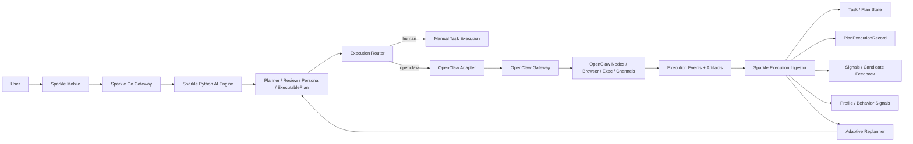

# Sparkle x OpenClaw 集成方案草图

更新时间：2026-03-27  
定位：架构草图 / 立项评审输入稿  
结论口径：基于当前 Sparkle 仓库真实状态与 OpenClaw 官方文档能力边界

## 1. 背景与目标

Sparkle 当前已经具备较强的需求理解、方案生成、任务拆解、用户画像注入、反馈学习与重规划能力，但任务执行层仍以用户手动推进为主。

目标不是把 Sparkle 变成第二个执行器，而是让：

- Sparkle 继续扮演规划大脑与闭环控制层
- OpenClaw 扮演数字世界执行器与设备网关
- 两者共同形成 `需求 -> 方案 -> 任务 -> 执行 -> 反馈 -> 更新画像 -> 优化未来操作` 的闭环

这条路线只应优先覆盖数字任务：

- 资料检索
- 浏览器操作
- 脚本执行
- 文档整理
- 消息发送
- 跨节点设备动作

对纯人类任务，例如学习、运动、现实世界执行，OpenClaw 只能做辅助执行、取证、提醒和回填，不能被定义为完全替代用户。

## 2. 当前项目真实情况

### 2.1 已有能力

Sparkle 现有主链已经具备执行闭环骨架：

- 自研 Orchestrator 是生产主链，不依赖外部框架托管核心业务
- LangGraph 已用于复杂规划，统一输出 `ExecutablePlan`
- `ToolExecutor` 已支持工具参数校验、执行、异常记录、补偿和执行观察
- `PlanExecutionRecord` / `PlanExecutionRecordService` 已支持执行结果持久化
- `signals/feedback` 已支持记录候选动作反馈
- `AdaptiveReplanner` 与 `BehaviorSignalCollector` 已支持将反馈与行为模式回流到后续规划

当前产品侧的任务执行仍偏人工：

- 进入任务执行页后，移动端主要是在本地计时并调用服务端 `start` / `complete`
- 服务端完成任务后会触发反馈、计划进度更新和自适应重规划

### 2.2 已知限制

- 当前任务主要是“对人可执行”，不是“对机器可执行”
- 执行层与设备/浏览器/系统动作之间缺少统一适配器
- 当前没有面向外部执行器的标准任务协议
- 当前没有把外部 agent 执行结果稳定映射回 Sparkle 任务状态、画像信号与执行记录

### 2.3 最新进展中可直接复用的基础设施

最近状态表明下列能力已可复用：

- Go gateway 的 WebSocket 连接跟踪与 push delivery 已完成
- 移动端的 SyncEngine 已接入 request / feedback / passive signals
- 被动信号、结果回传、内部推送链路已经有现成基础

这意味着 Sparkle 现在最缺的不是“再建一个闭环系统”，而是补上一层 `Execution Adapter + Event Ingestor`。

### 2.4 OpenClaw 最新能力边界

截至 2026-03-27，OpenClaw 官方文档显示它已经具备以下接入方式：

- HTTP Webhooks：`POST /hooks/agent` 可触发独立 agent run
- Gateway RPC：`agent` 与 `agent.wait` 可建立更完整的运行控制与等待结果机制
- Hook / Plugin Hook：可在 `before_tool_call`、`after_tool_call` 等环节拦截
- Nodes：可把动作落到 macOS / iOS / Android / headless 节点
- Exec Approvals：可对高风险动作做审批、允许一次、加入 allowlist

因此，从平台能力上，OpenClaw 足以承担 Sparkle 的“外部执行器”角色。

## 3. 系统架构图



### 3.1 分层原则

- Sparkle 负责理解需求、生成计划、决定是否能自动执行、审查风险、回收反馈
- OpenClaw 负责执行数字动作，不拥有 Sparkle 的业务主导权
- 执行结果必须先进入 Sparkle 的规范化摄取层，再更新任务、计划和画像

### 3.2 关键新增组件

建议新增三个模块：

1. `Execution Router`
   - 根据任务类型决定走 `human`、`openclaw` 或 `hybrid`

2. `OpenClaw Adapter`
   - 负责把 Sparkle 的任务协议转成 OpenClaw 请求
   - 管理 runId、sessionKey、idempotencyKey、超时、取消、审批状态

3. `Execution Ingestor`
   - 接收 OpenClaw 结果与事件
   - 回写任务状态、执行记录、signals、画像信号

## 4. 任务协议设计：ExecutionIntent

当前 Sparkle 的任务结构适合给人看，但不够适合给执行器跑。  
建议增加一个面向执行层的标准协议 `ExecutionIntent`。

### 4.1 设计目标

- 把“人类任务”与“机器任务”分开
- 把自然语言愿望转成结构化执行指令
- 能约束工具、权限、环境、成功标准
- 能稳定回写结果

### 4.2 建议结构

```json
{
  "intent_id": "exec_01HQ...",
  "plan_id": "plan_xxx",
  "task_id": "task_xxx",
  "step_id": "step_xxx",
  "user_id": "user_xxx",
  "execution_mode": "agent",
  "executor": "openclaw",
  "target_env": "browser",
  "goal": "登录邮箱并整理今天未读邮件，输出三条重点待办",
  "instructions": [
    "仅访问允许域名",
    "不要发送任何消息",
    "最终输出结构化摘要"
  ],
  "inputs": {
    "artifacts": [],
    "context": {
      "persona_constraints": {
        "max_session_minutes": 20
      }
    }
  },
  "policy": {
    "approval_policy": "require_for_side_effects",
    "allowed_domains": ["mail.google.com"],
    "allowed_tools": ["browser", "read", "write_summary"],
    "allow_exec": false
  },
  "success_criteria": {
    "type": "structured_output",
    "required_fields": ["summary", "todos", "confidence"]
  },
  "result_contract": {
    "evidence_required": true,
    "artifact_types": ["text", "screenshot"],
    "result_schema": "execution_summary_v1"
  },
  "timeouts": {
    "run_timeout_seconds": 300
  },
  "fallback": {
    "on_timeout": "return_partial",
    "on_blocked": "ask_user",
    "on_tool_denied": "handoff_to_human"
  }
}
```

### 4.3 必备字段

- `execution_mode`
  - `human | agent | hybrid`
- `executor`
  - 第一阶段只支持 `openclaw`
- `target_env`
  - `browser | shell | node | message | human`
- `policy`
  - 审批策略、允许域名、允许工具、是否允许 exec
- `success_criteria`
  - 防止执行完却无法判定成功
- `result_contract`
  - 约束回传结果格式

### 4.4 状态机

建议统一执行状态：

- `draft`
- `ready`
- `dispatched`
- `running`
- `waiting_approval`
- `blocked`
- `succeeded`
- `partial`
- `failed`
- `canceled`
- `handed_back_to_user`

## 5. API / 事件流

## 5.1 集成策略

### Phase A：PoC

Sparkle 通过 OpenClaw Webhook 触发执行：

- `POST /hooks/agent`

优点：

- 接入最快
- 不需要长期维持 WebSocket 会话
- 适合验证“任务能不能交出去执行”

缺点：

- 运行状态和事件控制较弱
- 更适合 demo，不适合最终产品闭环

### Phase B：产品化

Sparkle 改走 OpenClaw Gateway RPC：

- `agent`
- `agent.wait`
- 必要时配合审批与节点调用

优点：

- 可拿到 run 生命周期
- 更容易做取消、超时、重试、等待结果
- 更适合把执行状态同步回 Sparkle

## 5.2 Sparkle 内部建议 API

以下为建议新增接口，不是当前已存在接口：

### `POST /api/v1/tasks/{task_id}/handoff/openclaw`

用途：

- 用户点击“交给 AI 执行”
- 后端检查任务是否可执行
- 生成 `ExecutionIntent`
- 分发给 OpenClaw

返回：

```json
{
  "execution_id": "exec_xxx",
  "task_id": "task_xxx",
  "status": "dispatched",
  "external_run_id": "run_xxx"
}
```

### `GET /api/v1/executions/{execution_id}`

用途：

- 让移动端轮询或恢复执行状态

### `POST /internal/openclaw/events`

用途：

- OpenClaw 事件回流入口
- 只接内部签名请求

事件建议统一为：

- `execution.accepted`
- `execution.started`
- `execution.waiting_approval`
- `execution.tool_called`
- `execution.partial_result`
- `execution.succeeded`
- `execution.failed`
- `execution.canceled`
- `execution.handed_back`

## 5.3 推荐事件流

1. 用户在 Sparkle 中确认任务
2. Sparkle Planner 产出任务与可执行步骤
3. `Execution Router` 判断步骤是否可交给 OpenClaw
4. 生成 `ExecutionIntent`
5. `OpenClaw Adapter` 发起 run
6. OpenClaw 返回 `runId`
7. Sparkle 更新任务状态为 `dispatched/running`
8. 执行中的审批、阻塞、部分结果回流 Sparkle
9. `Execution Ingestor` 把最终结果写入：
   - Task 状态
   - PlanExecutionRecord
   - signals/feedback
   - 画像行为信号
10. `AdaptiveReplanner` 读取结果，影响下一轮任务拆解

## 6. MVP 范围

MVP 不应该追求“全任务自动执行”，只做最有把握的一段闭环。

### 6.1 MVP 覆盖任务

建议只支持以下四类：

- 网页信息搜集并总结
- 按规则整理文档或待办
- 执行只读型浏览器任务
- 执行低风险脚本或本地自动化

### 6.2 MVP 明确不做

- 金融转账
- 对外发信/发消息的自动发送默认开启
- 涉及密码重置、账号安全修改
- 无明确成功标准的开放式长任务
- 纯学习类、纯现实类任务的“全自动完成”

### 6.3 MVP 产品形态

建议只新增一个按钮与一条回流链路：

- 任务卡 / 执行页出现 `交给 AI 执行`
- 执行中显示：
  - 排队中
  - 执行中
  - 等待审批
  - 已完成
  - 已回退给你

### 6.4 MVP 数据落点

最低要求：

- 每次交付 OpenClaw 的 run 都要生成 Sparkle `execution_id`
- `execution_id <-> task_id <-> plan_id <-> openclaw runId` 必须可追踪
- 最终结果必须进入：
  - Task 状态
  - PlanExecutionRecord
  - Candidate feedback / passive signals

## 7. 风险与上线顺序

### 7.1 主要风险

#### 1. 任务语义风险

如果没有 `ExecutionIntent`，Sparkle 交给 OpenClaw 的仍然只是自然语言任务，执行质量会高度不稳定。

#### 2. 权限与安全风险

OpenClaw 具备真实执行能力，必须限制：

- agentId
- sessionKey
- allowed domains
- allowed tools
- exec approvals

#### 3. 幂等与重复执行风险

外部执行器最怕重复触发。必须引入：

- `idempotencyKey`
- 用户确认后的单次 token
- 去重的执行状态机

#### 4. 用户信任风险

如果用户看不懂 AI 在做什么、做到了哪一步、为什么卡住，会快速失去信任。

#### 5. 错误归因风险

需要区分：

- Sparkle 规划错误
- OpenClaw 执行失败
- 外部站点变化
- 权限拒绝
- 用户中途接管

### 7.2 上线顺序

#### 阶段 0：协议与路由

- 定义 `ExecutionIntent`
- 建立任务可执行分类器
- 新增 `execution_mode` / `executor` 字段

#### 阶段 1：PoC

- 仅接 `/hooks/agent`
- 只支持只读型低风险任务
- 结果先回写 Task 与简单 execution log

#### 阶段 2：产品化闭环

- 改接 `agent + agent.wait`
- 建立审批流、取消流、超时流
- 接入 `PlanExecutionRecord` 与 signals

#### 阶段 3：画像回流

- 把执行成功率、审批率、接管率、失败原因写入画像信号
- 让 `AdaptiveReplanner` 真正使用这些执行反馈

#### 阶段 4：能力扩展

- 引入 nodes
- 支持浏览器、移动节点和跨设备动作
- 引入更细粒度的任务模板与安全策略

## 8. 核心判断

### 8.1 为什么这件事值得做

因为 Sparkle 已经把“前半段”做得很强：

- 需求理解
- 方案生成
- 高质量任务拆解
- 画像约束
- 反馈学习

现在缺的是“把一部分任务真的做掉”的执行层。  
OpenClaw 正好补这块。

### 8.2 为什么不应该直接把任务全文扔给 OpenClaw

因为那样会失去：

- Sparkle 的业务控制权
- 可解释性
- 安全边界
- 结果可回写能力

正确姿势是：

- Sparkle 负责把任务变成结构化 `ExecutionIntent`
- OpenClaw 负责执行
- Sparkle 负责收口、归档、学习

### 8.3 最终建议

建议正式立项，但按以下口径推进：

- 不是“Sparkle 接一个外部 agent”
- 而是“Sparkle 增加一个外部执行层适配器”

第一阶段只做数字任务闭环。  
如果第一阶段跑通，Sparkle 的产品价值会从“会规划”升级成“能把一部分事真正做完”。

## 9. 参考

### Sparkle 仓库内证据

- `docs/00_项目概览/AI系统与任务闭环对齐文档_2026-03-10.md`
- `docs/系统全面审查报告_2026-03-26.md`
- `backend/app/orchestration/executor.py`
- `backend/app/models/plan_execution_record.py`
- `backend/app/services/plan_execution_record_service.py`
- `backend/app/api/v1/signals.py`
- `backend/app/orchestration/adaptive_replanner.py`
- `backend/app/services/behavior_signal_collector.py`
- `mobile/lib/features/task/presentation/screens/task_execution_screen.dart`
- `backend/app/api/v1/tasks.py`

### OpenClaw 官方文档

- https://docs.openclaw.ai/index
- https://docs.openclaw.ai/automation/webhook
- https://docs.openclaw.ai/concepts/agent-loop
- https://docs.openclaw.ai/gateway/protocol
- https://docs.openclaw.ai/nodes
- https://docs.openclaw.ai/tools/exec-approvals
- https://docs.openclaw.ai/gateway/openresponses-http-api
