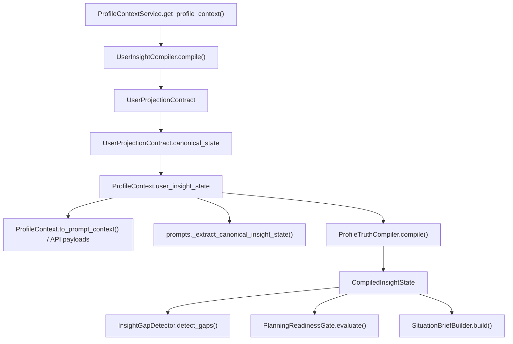

# SPARKLE Aurora Stage 7 C1 Call Chain (2026-04-19)

> **Status**: `WS-C1` Phase 1 analysis artifact
> **Purpose**: record the actual call chain between the canonical user-model compiler and the Phase A planning/runtime projection before deciding how to normalize ownership.

## 1. Actual Call Chain

## 2. Code Reality

### Canonical owner

The canonical fact owner is already:

`ProfileContextService -> UserInsightCompiler -> UserProjectionContract -> UserInsightState`

Key evidence:

- `backend/app/services/profile_context_service.py`
- `backend/app/services/user_insight_compiler.py`
- `backend/app/profile/projection_contract.py`
- `backend/app/core/user_insight_state.py`

### Prompt path

The prompt path now consumes canonical state directly via:

- `backend/app/orchestration/prompts.py::_extract_canonical_insight_state`
- `backend/app/orchestration/prompts.py::_normalize_user_context`

This means Stage 6 already made canonical truth visible to prompt rendering.

### Situation-brief path

The situation-brief path currently does:

1. parse `profile_context`
2. call `ProfileTruthCompiler.compile()`
3. when canonical state exists, call `UserInsightState.to_legacy_projection()`
4. build `CompiledInsightState`
5. run `InsightGapDetector` and `PlanningReadinessGate`

This means `ProfileTruthCompiler` is **not** a parallel fact compiler.
It is an **adapter/projection layer** that still contains a raw-profile fallback branch.

## 3. Decision

`WS-C1` chooses **adapter-only normalization**, not merge and not immediate elimination.

### Why not merge

- `CompiledInsightState` is still the runtime contract consumed by `InsightGapDetector`, `PlanningReadinessGate`, and `SituationBriefBuilder`
- a forced merge would widen scope into Phase A planning surfaces that Stage 7 did not authorize

### Why not immediate elimination

- `ProfileTruthCompiler` still owns the no-canonical fallback path for contexts that only provide raw `ProfileContext`
- deleting it in Stage 7 would turn a normalization task into a broader compatibility migration

### Why adapter-only is the right Stage 7 move

- it matches current code reality: canonical truth already exists upstream
- it reduces duplicated interpretation logic without introducing a third compiler
- it preserves compatibility for fallback consumers while making ownership explicit:
  - `UserInsightCompiler` owns fact compilation
  - `ProfileTruthCompiler` owns adaptation into `CompiledInsightState`

## 4. Normalization Target

Stage 7 `WS-C1` should therefore:

1. make canonical-to-runtime projection explicit in one place
2. make `ProfileTruthCompiler` a thin adapter over that projection when canonical state is present
3. keep the raw `ProfileContext` fallback for contexts where canonical state is absent
4. add tests proving prompt and situation-brief consume aligned canonical signals

## 5. Non-Goals

`WS-C1` does **not**:

1. create a third compiler
2. redesign `CompiledInsightState` schema in a breaking way
3. move fact ownership away from `UserInsightCompiler`
4. remove the fallback path in the same change
