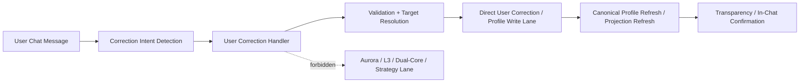

# SPARKLE Aurora Stage 9 IC2 Correction Channel (2026-04-20)

> **Status**: pre-implementation artifact for `WS-IC2`
> **Purpose**: freeze the chat-native User Correction architecture before any Stage 9 correction code lands.

## 1. Why This Exists

Stage 9 `WS-IC2` is the highest-value user-front-door feature and the highest governance-risk feature.

The user must be able to say "that's not right" inside chat without that correction being routed through:

1. Aurora
2. dual-core steering
3. strategy-lane writes
4. any L3 control channel

This artifact freezes the allowed path.

## 2. Core Rule

**Chat-originated profile correction is a User Correction action, not an Aurora control action.**

That means:

1. the user is correcting truth
2. the system is recording and projecting that correction
3. no Stage 8 bounded-steering helpers may be used

## 3. Channel Diagram

## 4. Allowed Responsibilities

### 4.1 Correction Intent Detection

This layer may:

1. recognize that the user is correcting a claim
2. resolve the target claim / field / value
3. collect optional rationale and evidence references

This layer may not write profile truth directly.

### 4.2 User Correction Handler

This layer may:

1. validate the target field / claim
2. normalize the user-provided correction payload
3. choose the direct User Correction write path
4. trigger canonical refresh / projection refresh

This layer may not call Aurora or L3 write helpers.

### 4.3 Direct User Correction Write Lane

This layer may reuse direct profile-truth services such as explicit preference / override / correction services, as long as they are part of the profile-truth lane rather than the strategy-control lane.

This layer must:

1. preserve evidence refs for the correction event
2. preserve user attribution
3. make the correction visible to later canonical read paths

### 4.4 Transparency / Confirmation

After write success, the system must be able to show:

1. what claim or field was corrected
2. whether the change is now reflected in canonical read output
3. which evidence class the updated answer belongs to

## 5. Forbidden Paths

The following are explicitly forbidden for `WS-IC2`:

1. `UserStrategyStateService`
2. `CapabilityKnobGovernor`
3. `ExperienceActuator`
4. `dual_core_router`
5. `adaptive_adjustments`
6. any Aurora runtime parameter carrier

If any chat-originated correction needs one of the above to work, the design is wrong.

## 6. Evidence Model

Each correction write must preserve:

1. `user_message` or compact user-provided rationale
2. target field / claim id
3. source = `user_correction`
4. evidence refs or source refs when available
5. timestamp

The goal is that later `WS-IC1` reads can say:

1. this is now user-corrected truth
2. this remains an inferred / projected conclusion

## 7. Refresh Contract

After a successful correction write:

1. canonical profile read surfaces must refresh
2. transparency payload must reflect the corrected state
3. the in-chat front door must be able to confirm the change without requiring a separate settings-screen roundtrip

## 8. Minimum Acceptance Shape

`WS-IC2` is accepted only if:

1. a chat correction flows through the User Correction lane only
2. no forbidden Stage 8 strategy-lane helper is touched
3. a subsequent canonical read reflects the correction
4. the user receives an in-chat confirmation with the updated classification

## 9. Implementation Notes

Stage 9 should prefer:

1. a dedicated profile-front-door tool / handler for chat corrections
2. direct use of profile-truth write services already used by explicit profile correction flows
3. explicit tests that fail if strategy-lane helpers are invoked

Stage 9 should avoid:

1. reusing the current generic `/corrections` suggestion box as the final architecture
2. silently merging correction into "system adjustments"
3. hiding whether the updated claim is user-provided, projected, or inferred
