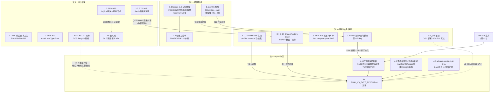

# Sparkle v3 门后总执行手册（master runbook）— wt788

> 2026-09-28 ｜ 编排：wt788 ｜ 基线：main@`cb122a22`（撰写中途 main 前进至 `5833639a`：wt784 J-02PREP 包以 `88ff9e45` 并入 main，本手册 §3.1 直接引用之；台账与 tasks.json 在两时点逐字节未变，已 diff 实证）
> 性质：纯汇编+规划卡。本手册不改台账、不改任何 FIX 行、不触碰运行栈与 `/tmp/northstar_ns001_real_drive_state.json`。所有账面状态以执行时点现行台账为准——**每项动工前先重读该 FIX 行**（门后集中窗口内 main 会持续前进，本手册的编号映射可能已被在途会话部分消化）。
> 台账机器校验工具：`scripts/devtools/ledger_union_merge.py --verify --strict-pipes`（用主仓 venv）。任何台账落位/合并后必跑。

---

## 0. 一页速览

- **OPEN 总量**：44 行（含 439）。唯一 OPEN P1 = **FIX-530**（FIX-53 已由 wt779 翻状态格收口，`FIXED@10d3d7e8`，勿再当作 P1 在账）。
- **波 1（机械集成，立即可做）**：3 项 —— wt755 集成（重编号 491→498）、台账卫生卡（504/510/514/222 + 工具自检）、不需要裁决。
- **波 2（派卡修复）**：5 张卡 + 1 个长尾池 —— 卡A(528+532 测试/脚本卫生)、FIX-530(P1)、FIX-529、FIX-507(双审)、FIX-495(裁决前置)。
- **波 3（需钥匙/设备/真栈整窗）**：5 项 —— J-02 simulator 实跑、E-08 真模型复测+四笔销账、FIX-505 残差 ops 卡、Q-07 chaos 终验（真栈整窗、双审）、人/外部项（O-01、FIX-511 三端采集）。
- **波 4（Q-08 收口）**：4 项 —— 四个预裁决项拍板、零成本索引+低成本补证、release-manifest git SHA 缺口、FINAL_V3_GATE_REPORT.md。
- **总项数**：17 个编号工作项，覆盖全部 44 行 OPEN、2 张销账卡（E-08/J-02）、2 张未启动卡（Q-07/Q-08）。

---

## 1. 依赖图



缩进树版（无 mermaid 渲染时）：

```
波1  1.1 wt755集成 ──→ 3.2 E-08复测（首帧重采前置）
     1.3 ledger工具自检 ──→ 1.2 台账卫生卡（工具先行，卫生卡用其自检验收）
波2  2.2 FIX-530(P1) ──→ 3.4 Q-07（Work1 Redis issue 先修再验）
     2.4 FIX-507 ──→ 波4 V3-5 gate 判定口径（修后数据流 vs 如实 FAIL/PARTIAL）
     2.5 FIX-495（裁决）──→ S 系社群卡设计读模型前提
波3  3.1 J-02 ──→ Q-08 V3-1 gate
     3.2 E-08 复测+销账 ──→ Q-08 V3-8 gate + 4.1 SLO 修订决议输入
     3.3 FIX-505 ops 卡 ──→ Q-08 V3-9 gate（备份链口径）
     3.4 Q-07 ──→ 4.4 FINAL（Q-08 唯一卡级前置）
波4  4.1 裁决（含 FIX-513）+ 4.2 补证 + 4.3 manifest SHA ──→ 4.4 FINAL_V3_GATE_REPORT.md
```

---

## 2. 推荐执行序（逐项：前置 / 操作要点 / DoD / 验收人 / 耗时）

耗时标尺：微卡 ≤1h ｜ 小卡 1-3h ｜ 中卡 半窗 ｜ HEAVY 一窗。

### 波 1 —— 立刻可做的机械集成（无裁决/无 key/无设备依赖）

#### 1.1 wt755 集成（E-08 SLO L0 首帧前移，`938e845c` → main）

- **前置**：分支 `agent/node-b/wt755/slo`@`938e845c` 在库（已核实在册）；wt785 独立审查 **APPROVE-for-integration**（`v3-output/WT785-WT755REV/receipt.md`）。集成时确认 498 号仍空闲（`grep -c "V3-FIX-498"`，被占则回退 **533**，533 占用则顺延并全库 grep 复核）。
- **操作要点**：
  1. merge `938e845c`；**唯一预期冲突文件 = `v3/06_agent_fleet/DYNAMIC_ISSUES.md`**（表尾 append 撞行；439 行进展注记 hunk 与主干逐字节相同可干净落位，receipt §5 已 merge-tree 实证）。
  2. **重编号 491→498，同步三处引用**（均在 wt755 新增文本内）：① 新行行首 ID；② 该行出处格「预分配号 491 grep 复核空闲…备用 492 未动」改写为重编号注记（按「集成即纠指针」先例注集成 SHA）；③ 439 行进展注记内「预占 V3-FIX-491」→ 498。`v3-output/WT755-SLO/notes.md` 为冻结产物不改。
  3. 新行落位 = 改 ID 后置于表尾现行最高行后；**439 行保持 OPEN**（其注记明确：端到端 SLO 达标需有 key 环境真模型 bench 复测，即 §3.2）。
  4. 落位后重跑 `ledger_union_merge.py --verify --strict-pipes`。
- **DoD**：merge 落 main；重编号三处同步完成；ledger verify 通过；触达面测试在集成 SHA 复跑绿（4 测试文件 42 用例 + 受影响面合集，wt785 预审 1419 绿可作对照基线；唯一允许红=notes 预报的 `test_signal_spine` 既有 flaky，单跑须绿）；ruff/mypy delta=0。
- **验收人**：主会话机械执行 + ledger verify；独立审查已由 wt785 完成，无需新审。
- **耗时**：小卡（1h 内）。

#### 1.2 台账与证据链卫生卡（FIX-504 / 510 / 514 / 222 + 502 / 509 注记面）

- **前置**：波 1.3 工具自检已可用（用它做验收）；**账面编辑权归集成会话**（执行 worker 只报不写，wt784 纪律沿用）。
- **操作要点**：
  - FIX-504：258 行闭账指针重建（修复本体已在主干，行尾双 OPEN 零 FIXED@）。
  - FIX-510：377 行缺失——按主干修复本体补行或注记（分两支处置按行内说明）。
  - FIX-514：不动台账行（无账可改）；在 O-05 相关 receipt/notes 层面注记「备份脚本缺陷=卡内修复无台账行，检索锚=commit `1680d16c` 本体，号 504/520 均无效」。
  - FIX-222：6 行表行粘连修复（纯格式）。
  - FIX-502/509（M/X 线与 D/E 线卡级证据断链）：按 D-line/E-line 章节给的可回收清单回收原件或注记纠指，不伪造证据。
- **DoD**：ledger verify 通过 + 1.3 自检三项抽检零红；每行处置有出处（不新增无证据结论）。
- **验收人**：独立未参与会话审（普通任务）。
- **耗时**：小卡（2h）。

#### 1.3 ledger 工具自检增强（FIX-514 修法建议 + wt779 §Q.5 同族合并）

- **前置**：无。
- **操作要点**：`scripts/devtools/ledger_union_merge.py` 增三项抽检——① 行内 FIXED@ SHA 主干可达性；② 行首状态枚举与行内 FIXED@ 一致性（FIX-53/512 型「状态格未翻」变体）；③ commit message 引用号 vs 台账行存在性抽检。新增自检只报不改。
- **DoD**：自检在现行台账上运行，产出的报告与人工盘点一致（44 行 OPEN 口径对齐）；对既有已知案例（53/504/508/510）能报出正确结论。
- **验收人**：独立审查（普通）。
- **耗时**：微卡-小卡（1-2h）。

### 波 2 —— 需派卡的修复（工程窗口，逐卡独立分支 `agent/<node>/<task>/<fence>`）

#### 2.1 卡A「测试与脚本卫生」= FIX-528 + FIX-532 合并（建议合并，理由见 §3）

- **前置**：无。
- **操作要点**：
  - FIX-528：`tests_e2e/test_galaxy_e2e.py`（596 行，import 幽灵类 RAGService 全仓不存在，pytest 收集即 ERROR）——**整文件删除**（优先，符合「死文件清理」先例）或按 galaxy E2E 现状重写；删除前 grep 分片清单/CI 引用。
  - FIX-532 四项：① restore 无密码路径 `_redis_cli_args=()` 空数组 bash 3.2 兼容改写（`set -- ${arr[@]}` 或长度判断；本机 bash 3.2.57 实测崩溃点在 PG 恢复完成后=最脆弱时点）；② backup MinIO skip 分支与 checksum 步自相矛盾对齐；③ INV-5 复活判据改实质判据（复活前后 run 序列连续性/幽灵 ID 检出，替换恒假的 `recallable>total`）；④ red/green restore 演练日志入库存档（2156 之数可复核）。
- **DoD**：`pytest --collect-only tests_e2e` 零收集错误；restore 脚本在 bash 3.2 下 dry 全程通过；INV-5 新判据在演练容器复跑一次 PASS 且对注入复活场景能红。
- **验收人**：独立审查（普通）。
- **耗时**：小卡（2-3h）。

#### 2.2 FIX-530（P1，唯一 OPEN P1）——Redis 瞬断杀 engine 进程

- **前置**：无（可最先派）；**Q-07 的直接前置，先修再验**；修复期间心跳探活盯防复发。
- **操作要点**（台账修法方向）：① billing 队列消费者 BLPOP 循环对 `ConnectionError` 重连退避（单循环异常不拖垮进程）；② 进程面自动拉起（nohup 升 supervisord/launchd）。实现分支 `agent/<node>/fix530/<fence>`。
- **DoD**：注入实验（重启 sparkle_redis 或等价瞬断）后 engine `/health` 持续 200、无 `Application shutdown failed`、日志有退避重连记录；正式回归测试钉住（修前红：进程退出；修后绿）；邻域 billing/orchestration 测试绿；**engine smoke 重跑**（/health + 一轮真链路 chat 流）。
- **验收人**：**建议双 reviewer**（P1 + engine 进程生命周期热路径）。
- **耗时**：中卡（半窗）。

#### 2.3 FIX-529 —— SummarizationWorker rpush `ex=` TypeError 全灭

- **前置**：无。发现者 wt778 已声明行为变更超出其授权面，需独立卡。
- **操作要点**（三选一，卡内先做消费方核查再定）：① `rpush` 后补 `expire("logs:summarization", 86400)`（整队列 TTL，语义近似原意，推荐默认）；② Pipeline `rpush().expire()` 原子化；③ 若队列确认无消费方则删功能+登记。**同时全仓 grep 其余 `rpush(..., ex=` 同族调用**一并处置。
- **DoD**：新测试红→绿（修前 TypeError 被吞+队列恒空；修后条目在队+TTL 在）；mypy call-arg 该条消失（delta 只降不升）；邻域 orchestration 测试绿。
- **验收人**：独立审查（普通，1 reviewer）。
- **耗时**：微卡（≤1h）。

#### 2.4 FIX-507（P2）—— D-05 intervention lifecycle 生产接线（T-d05-lifecycle-production-wiring）

- **前置**：无硬前置；建议在 Q-08 前完成以改变 V3-5 gate 判定基础。
- **操作要点**（台账修法方向，属产品接线=行为面新增）：① 交付面（InterventionEventConsumer 标记 delivered 处 / Aurora decision 执行点）调 `record_exposure`+`record_response`；② D-02 ledger 增量扫描定时任务调 `associate_pending_outcomes`。接入后 D-07 friction-pattern / interventions-that-helped 两类洞察卡与 M-06 经验投影获得真实数据流。
- **DoD**：集成/契约测试证明生产调用方在场（非仅评测 harness）；跑一轮真链路后 `intervention_lifecycle_events` 表有生产写入；D-07 两类卡可出卡；D-08 飞轮闭环复验不回退。
- **验收人**：**两位 reviewer（台账明示）**。
- **耗时**：中卡（半窗-1 窗）。

#### 2.5 FIX-495 —— community post CQRS 零生产者+零读者（裁量类，先裁决后派卡）

- **前置**：**协调方二选一裁决**：(a) 接线复活（engine posts 写路径补 event_outbox 行 + 网关读侧路由，双真源取舍须文档化）或 (b) 外科下线（投影 worker/handler/键退役，`task_projection_retired_guard_test.go` 先例）。**S 系社群卡设计读模型前必须先裁决**，避免按「投影已活着」错误前提设计。
- **操作要点**：裁决产出后按所选支路派卡；FIX-461/469/481 耐久链的承载面随裁决同步说明（(b) 支路由 task/galaxy 流继续承载）。
- **DoD**：(a) 支——community.post.* 事件入 outbox、投影键有读者、XLEN>0、461/469/481 链在 community 流有真实流量验证；(b) 支——退役守卫测试红→绿、键与 worker 下线、feed 面回归绿（engine 直读不受扰）。
- **验收人**：(a) 支双审（跨 engine+gateway 行为面）；(b) 支单审+守卫钉。
- **耗时**：裁决 0.5h；卡 (a) 一窗 / (b) 半窗。

#### 2.6 长尾池（34 行非阻塞 P3/P4，不阻 Q-07/Q-08，按剩余窗口容量派）

分组派卡建议（按触达面聚类，群内可共卡）：
- **engine/Python 小修族**：188（先出 shadow 三态映射裁决表再动判据）、161/162（池预算观测/BillingWorker 生命周期入关停链）、218/237（类型注解 None 返回，mypy 族）、299/308/317（证据账本重放首行/收尾 gather 超时/validate_message 拒绝门）、321（测试时钟残留 43 文件清扫）、176/175（测试环境隔离两例）。
- **mobile/Dart 族**：199（开发栈术语屏）、220/256（l10n 镜像与 gen-l10n 版本漂移）、261（死键复活余量，部分已修@b98c7ca1）、373（无语义节点 allowlist 棘轮，已钉只降不升）、375（U-02 残余双债）、379（X-07 消费面③挂载）、385（同名 provider 普查②~⑥）、430（share_post）。
- **数据/结构族**：290（focus streak 双时钟裁决）、291（guard 盘点盲区）、524（last_activity_date 列漂移）、358（U-01 悬空重建待裁）。
- **已在航/已登记勿重复派**：500/501（wt765/o06 分支）、504（wt769/docbc）、510（wt775/upsg）、524（wt777/p499）——门后按各自分支集成走正常验收，本手册只挂账不派新卡。
- FIX-503（FIX-36 真模型复验欠账）**并入 §3.2 E-08 复测窗口**顺收（同为有 key 环境义务）。

### 波 3 —— 需用户 / 钥匙 / 设备 / 真栈整窗

#### 3.1 J-02 simulator 实跑（销账 J-02；wt784 预备包已并入 main@`88ff9e45`）

- **前置**：运行栈 up（`make dev-up` + gateway :8080 + engine :8000/:50051）；macOS desktop 通道就绪（`flutter doctor -v`，防 dartaotruntime 断链前科）；**执行会话是唯一授权触碰运行栈的 J-02 环节**。
- **操作要点**：照 `v3-output/WT784-J02PREP/runbook.md` 机械执行——第一件事是编写 `integration_test/j02_fastpath_journey_test.dart` 驱动（当前不存在，红→绿形制，产品代码零改动）；Leg R（注册端 ≤3min 秒表×5 persona）/ Leg G（游客端 seed 不进真实 Memory + 只读 DB 探针双 0 行）/ Leg U（升级原位翻转）；产物落 `v3-output/WT784-J02-SIM/`（run_manifest/timings/steps/db_probes/proposals/screenshots/logs）。失败留证不重跑抹除；注册弹回走 J-01 诚实 fallback 并降级口径。**新缺陷自 V3-FIX-533 起登记**（若 1.1 重编号回退占了 533，则从 534 起，动手前 grep 复核）——只写执行 notes，不编辑台账。
- **DoD**：§7 判据映射表逐条回填；A1 秒表 ≤180s×5 persona；A1b DB 探针双 0；A2 三端 session 稳定；F1-F7 全落点有产物。
- **验收人**：独立未参与会话审（含视觉 rubric 打分，F7）；引用 wt772 receipt `7bbaf092` 作销账前置闭环；随后 J-02 销账。
- **耗时**：半窗-一窗（HEAVY 卡）。

#### 3.2 E-08 复测 + 四笔销账（销账 E-08；需 API key 环境）

- **前置**：**1.1 wt755 已集成**（首帧重采的前提）；key 环境可用；wt372 驱动与 Q-06 bench 五件在库（`v3-output/WT372-E08-BENCH/` + `scripts/devtools`@`12e89303` 交付）。
- **操作要点**（E-line §E.2-E-08④⑤ 销账四件事）：① **review receipt**（卡面 Reviewers:1，独立签收）；② wt755 集成（=1.1）；③ **E-03 Leader 裁决残差移交笔**增量闭环（端到端前段延迟复测记录进 E-08 卡）；④ **真模型复测最小集 = Q-06 同构 400 样本 + wt755 集成后首帧重采**（run_tag/raw.jsonl 口径同构）。顺收 FIX-503（真模型复验同窗）与 FIX-439 的复测证据（采后按账面纪律翻 439，编辑权归集成会话）。
- **DoD**：新 raw.jsonl/facts/REPORT 入库；与修前基线（wt372 104 条：L0 TTFT p50 1.11s / L3 ACK 7.03s / tier 塌缩 85/85）对比表产出——预期 L3 ACK 已转准（Q-06 复测 0.06s）、首帧分布应较 21/103≤500ms 改善；L0 no-model 1879ms 与 L2 total ~48s 两项 FAIL 如实报告并进 4.1 SLO 修订决议；E-08 置 done + dynamic issues 更新。
- **验收人**：独立审查（普通，卡面 1 reviewer）。
- **耗时**：半窗。

#### 3.3 FIX-505 残差 ops 卡（dev compose 错位 + prod AOF 备份面）

- **前置**：脚本面已修（wt773 分支 CONFIG dir 感知；执行前核实该分支是否已并入 main，未并入则随本卡一并落）。
- **操作要点**：① dev `docker-compose.yml` sparkle_redis 持久化错位裁决——`--dir /data` 或改挂载 `/var/lib/redis-stack`（prod 已有 `--dir /data`@docker-compose.prod.yml:618，wt782 纠偏）；② prod AOF/backup 缺口：`appendonly yes` 而 backup 仅捕 RDB、restore 仅落 dump.rdb——AOF 加载期优先，RDB-only restore 在 prod 形态不可靠，需 backup 捕 AOF 或 restore 前置 AOF 处置的裁决与实现；③ backup RPO 窗口收紧与异地化（mc mirror 待办）属容量/运维决策，可拆给人。
- **DoD**：dev 栈重建后 `CONFIG GET dir` 落在挂载卷；restore 演练在 AOF-on 形态 keys loaded>0 且逐值核对；改动有红→绿或演练实录。
- **验收人**：独立审查 +（RPO/异地化面）HUMAN_INBOX。
- **耗时**：小-中卡；**动运行栈（dev 栈重启）**。

#### 3.4 Q-07 Chaos / Recovery / Offline / Restore Storm 终验（critical/HEAVY/双审）

- **前置**：tasks.json 依赖 X-09✓ O-05✓（已 done）U-06✓ 全满足；**工程前置=2.2 FIX-530 先修再验**（Q-line §Q.2 明示建议）；锁 `chaos-eval`。
- **操作要点**（Q-line §Q.2 执行计划草案，资产全在库）：① chaos rig=`q06_provider_chaos.py`+mock 上游 :9099+场景间引擎重启隔离纪律；② 恢复面=O-05 `restore_consistency_check.py` INV-1..7+已修 backup/restore 脚本+WT773 一次性容器栈形制（零触碰常驻栈）；③ 失败语义面=X-09 failure_semantics+X-05 sweep+461/469/487 耐久测试族。Work 六项：worker kill（SIGKILL celery mid-task→PEL 重放断言）、Redis issue（瞬断/重启——验 2.2 修复面）、Celery backpressure 真栈面、network toggle/app restart（GJ13/14 已 PASS 面+U-06 状态机）、**20 concurrent restore**（一次性栈+INV-1..7+M-07 墓碑/epoch 门）、EndpointShield/dispatch async 回归。remote 段若 O-01 未解锁则如实 RESTRICTED。
- **DoD**：false success=0（chaos S4b「模板顶替」回归探针语义）；duplicate=0（X-09 幂等纪律+FIX-335/336 闸）；历史 restore storm SLO 不大幅退化（锚=X-09 SIGKILL e2e+461/469/487 基线）；产物入 v3-output。
- **验收人**：**双 reviewer**（卡面 2）。
- **耗时**：一窗（HEAVY）。

#### 3.5 人 / 外部项（不阻工程，进 HUMAN_INBOX）

- **O-01**（HTTPS 远程部署/远端 endpoint/密钥服务端验证）：TODO，需用户凭据与服务器——解锁则 V3-9 可全 PASS，否则 Q-08 按 BLOCKED 注记。
- **FIX-511 三端实机采集**（U-09 45 张矩阵/G-05 真机批/U-08 走查/Q-02 HUMAN_INBOX 清单 17 项）：需真机/浏览器权限，集中采集批次安排一次。
- O-05 的 backup RPO 收紧/异地化（3.3 拆出）、费用/商户/上线类既有 HUMAN_INBOX 项照旧。

### 波 4 —— Q-08 收口（V3 Final Gate Audit / Commercial RC；critical/MEDIUM/双审；锁 `release`）

#### 4.1 四个预裁决项（协调方**预先拍板**，避免审计会话变成裁决会话——Q-line §Q.4-6）

1. **portfolio 词表真源（=FIX-513）**：建议 B-01 矩阵为准（`v3-output/B-01/MODULE_MATRIX.csv`，五态 42/42 EXACT MATCH）、`MODULE_PORTFOLIO.md` 降级 desired-role 参考并加注；随裁决产出词表映射表（SECONDARY/CORE_OPTIONAL/INTERNAL→五态）；按 HEAD 重跑 B-01 式审计或显式钉「矩阵时点=XXX，其后变化见 FIX-490/GOV-015」注记。
2. **V3-2 映射口径**：「20 个代表性 friction scenario ≥18」无直接单数证据——裁决 evidence link 映射（最近似锚=A-08 四臂+Q-01 contract-simulation 判定）。
3. **SLO 修订决议**：L0 1879ms / L2 total 48.25s 两项 FAIL——按 DoD 原文「SLO 不达必须重新定真实 SLO」产出修订决议而非沉默 FAIL（输入=3.2 复测数字）。
4. **三端条款双口径**：真机段 BLOCKED（FIX-511 未采集）/ API 级+模拟器 PASS 双口径并行标注。

#### 4.2 零成本索引 + 低成本补证

- 零成本：O-06 `GET /api/internal/ops/release-manifest` 抓取 + 各 gate 产物程序化索引（Q-line §Q.4-2 证据图即底稿，11 gate 逐条标 PASS 候选/需补/需裁决）。
- 低成本补证：`trace_timeline.py` 跑真 GJ 重建 O-02 运行级 trace 证据；**Q-02 全 20 GJ 与 Q-04 六路红队修复后全量重跑各一次**（驱动在库：`scripts/devtools/q02_run_golden_journeys.py` / q04 驱动；真栈形制 wt400/wt460 先例，各约半窗）——还掉「修而不复跑」的终门口径债（Q-line §Q.3-5：必须一次性还掉或显式裁决，三选一：补跑/按锁级判/如实 FAIL NOT_REMEASURED；本手册建议补跑）。
- 「100 run ≥99 terminal」批量统计锚从 X-05/09 测试面提取或补跑。

#### 4.3 release-manifest git SHA 缺口

- O-06 设计决定「运行时进程不可靠自证构建 SHA」→ 二选一随 manifest 生成执行：(a) build-time 注入（属 O-01 部署面，若 O-01 已解锁）；(b) **带外记录集成 SHA 并在 manifest 注记**（门后默认选 b，零部署依赖）。缺口② deploy 段=BLOCKED/本地 compose 形态注记；缺口③ runbook 引用 RUNBOOK_DEMO.md+`docs/05_部署与运维/RUNBOOK_LLM_HEALTH_RESET.md` 先例。

#### 4.4 产出 FINAL_V3_GATE_REPORT.md

- **前置**：3.4 Q-07 done（唯一卡级前置）；4.1 裁决在案；4.2/4.3 落盘。
- **操作要点**：DoD V3-0..V3-10 逐条 evidence link+PASS/FAIL/BLOCKED/NOT_RUN；V3-5 若 FAIL/PARTIAL 引 FIX-507 根因指针（若 2.4 已修则有真实数据流可改判）；V3-4 引 Q-04 复测结果并如实带上「uplift 0.0pp + A-08 no_memory 反超」已知边界；「107 任务完成」不得替代产品 gate（结构上已天然满足）；RC manifest/SHA/config/model/flags/deploy/runbook 一并入册。
- **DoD**：报告入库 + 双 reviewer 签收；所有 BLOCKED 项有 HUMAN_INBOX 指针。
- **验收人**：双 reviewer（卡面 2）。
- **耗时**：半窗-一窗（含 4.2 两个半窗补证则波 4 合计约两窗）。

---

## 3. FIX 派卡建议（合并 vs 独立）

| 处置 | FIX 行 | 理由 |
|---|---|---|
| **合并卡A** | 528 + 532 | 同为测试/脚本卫生机械面（死 e2e 文件 + restore/backup 脚本四项），触达面不相交、可单 reviewer 一次审完 |
| **合并卡B（账面卫生，集成会话专属）** | 504 + 510 + 514(注记) + 222 + 502/509(注记面) | 全部不动产品代码；统一用 1.3 工具自检验收；混入代码卡反而拖审查 |
| **独立卡（必须）** | 507 | 产品接线=行为面新增，台账明示需两位 reviewer，不可并入 |
| **独立卡（必须）** | 530 | P1 + engine 进程生命周期热路径，建议双审+注入实验，不与其他修复共分支 |
| **独立微卡** | 529 | 行为变更类（日志队列复活 vs 删功能三选一需卡内裁决），与 528 性质不同不硬并 |
| **裁决+卡** | 495 | 二选一裁决前置；裁决产出前不派工；(a) 支跨 engine+gateway 需双审 |
| **裁决+文档小卡** | 513 | Q-08 前置裁决项，产出=真源宣告+映射表+时点注记，无代码 |
| **随窗顺收** | 503 → 并入 3.2 E-08 复测；439 → 证据随 3.2 采后翻账 | 同为有 key 环境义务/同一复测数字 |
| **已在航勿重复派** | 500/501(wt765)、504(wt769)、510(wt775)、524(wt777) | 各有登记分支，门后走集成验收 |
| **长尾池共卡** | 161/162/175/176/188/199/218/220/222(如不并入卡B)/237/256/261/285/290/291/299/308/317/321/358/373/375/379/385/430 | 按触达面聚类（engine 小修/Dart/l10n/数据结构三群），群内可共卡降低派卡开销；均不阻 Q-07/Q-08 |

---

## 4. 风险注记

### 4.1 动 engine 热路径（完成后必跑 engine smoke：/health + 一轮真链路 chat 流 + 邻域测试）

| 项 | 热路径触点 | smoke 要求 |
|---|---|---|
| FIX-530 | billing 队列消费者（BLPOP 主循环）+ 进程守护 | 另加 Redis 瞬断注入实验（重启 redis 容器） |
| FIX-507 | InterventionEventConsumer 交付管线 + Aurora decision 执行点 + D-02 定时扫描 | 跑一轮含 intervention 的真链路后查 `intervention_lifecycle_events` 有写入 |
| FIX-529 | summarization worker（celery 面） | 邻域 orchestration 测试 + worker 启动日志无 TypeError |
| wt755 集成 | `orchestrator.py` StreamChat 前奏（ack 块前移） | 触达面合集复跑（1419 绿基线）+ 早退路径三面契约测试 |

### 4.2 动台账（重编号纪律）

- **所有 merge 的唯一预期冲突文件 = `DYNAMIC_ISSUES.md` 表尾 append 撞行**（wt785 已实证机理）——手工落位后**必跑 `ledger_union_merge.py --verify --strict-pipes`**。
- **号占用先 grep 复核再使用**：wt755 用 498（回退 533）；J-02 执行会话新发现自 533 起（若被 wt755 回退占用则 534 起）；撞号由集成侧重编号，先到先得。
- **重编号三处同步**范式（wt755 先例）：行首 ID + 出处格改写 + 前置行（439）进展注记；冻结产物（notes.md）不改。
- **账面编辑权归集成会话**；执行 worker 只在自有 notes 报告，不动台账（wt784 纪律）。
- 439 行**保持 OPEN** 直到 3.2 复测数字在案；FIX-508 式「就地在编辑内容于跨批合并丢失」前科——行编辑后 grep 闭账 SHA 计数核对已入集成纪律，沿用。

### 4.3 运行栈与数据

- **J-02 执行会话是唯一授权触碰运行栈的销账环节**；Q-07 用一次性容器栈（WT773 形制）零触碰常驻栈；FIX-505 ops 卡需 dev 栈重启（安排在无其他栈依赖任务的窗口）。
- **禁触 `/tmp/northstar_ns001_real_drive_state.json`**（JOURNEY ns001 七日驱动状态；day7 终门与 V3-10 分母证据）。
- FIX-530 修复合入前：心跳探活持续盯防 engine 复发死亡；07:35 升栈流程本含受控全重启，终门不受阻塞。
- 不以 Mock 冒充模型结果：3.2 复测必须真模型真路由；失败如实入库（E-08 卡面「SLO 未达真实报告+dynamic issues」正是交付形态）。

### 4.4 编排风险

- **main 在集中窗口持续前进**（本手册撰写期间即发生 cb122a22→5833639a）：每项动工前重读对应 FIX 行与 tasks.json 状态，防重复派卡/销号冲突。
- worktree 会被舰队回收（wt784 分支已删、内容并入 main）——引用素材一律以 **main 上路径**为准，不引用兄弟 worktree 绝对路径。
- Q-07 是 HEAVY 整窗且双审，应最早进入排队（其前置只有 FIX-530）；若窗口不够，Q-08 按 Q-07=NOT_RUN 如实标注，不得用「历史 X-09 面已验」替代。

---

## 5. 台账 OPEN 全清单（44 行盘点，编排去向）

**重点行（本手册 §2 逐项覆盖）**：

| 行 | P | 一句话 | 去向 |
|---|---|---|---|
| FIX-530 | P1 | Redis 瞬断杀 engine 进程（唯一 OPEN P1） | §2.2 波2，Q-07 前置 |
| FIX-507 | P2 | D-05 intervention lifecycle 零生产调用方 | §2.4 波2 双审 |
| FIX-529 | P2 | rpush ex= TypeError 日志队列全灭 | §2.3 波2 |
| FIX-505 | P2 | redis-stack 持久化错位（脚本面已修，dev compose+AOF 残差） | §3.3 波3 ops 卡 |
| FIX-528 | P3 | tests_e2e 死文件不可收集 | §2.1 卡A |
| FIX-532 | P3 | O-05 残余四项（bash3.2/skip矛盾/INV-5/日志入库） | §2.1 卡A |
| FIX-513 | P3 | portfolio 双真源词表分裂 | §4.1 波4 裁决 |
| FIX-514 | P4 | O-05 commit message 幻影号 504/520 | §1.2 卡B+§1.3 工具 |
| FIX-495 | P3 | community post CQRS 零生产者+零读者 | §2.5 波2 裁决前置 |
| FIX-439 | P2 | E-03 端到端首帧 SLO 残差（wt755 集成后仍保持 OPEN） | §3.2 复测后翻账 |
| FIX-53 | P1 | ~~chat 工具轮流中断~~ **已收口**：`FIXED@10d3d7e8`（wt779 翻状态格，V3-FIX-512 当场闭） | 无动作，防误报 |

**其余 33 行**：161/162/168/175/176/188/199/218/220/222/237/256/261/285/290/291/299/308/317/321/358/373/375/379/385/430（P3/P4 长尾池 §2.6）+ 500/501/502/503/504/509/510/524（账面卫生卡B、在航分支、随窗顺收，见 §3 表）。

---

## 6. 素材源指针（全部 main 可达）

| 素材 | 路径 |
|---|---|
| 台账 OPEN 行 | `v3/06_agent_fleet/DYNAMIC_ISSUES.md`（基线 cb122a22；44 行 OPEN 口径） |
| wt755 预审 verdict+重编号映射 | `v3-output/WT785-WT755REV/receipt.md`（APPROVE-for-integration） |
| Q-07/Q-08 执行计划+DoD 证据图+四裁决项 | `v3-output/WT779-DOC-OQ/Q-line.md` §Q.2/§Q.4 |
| E-08 完整性能图景（修前/已修/未修/复测路径/销账四笔） | `v3-output/WT776-DOC-DE/E-line.md` §E.2-E-08 |
| wt372 bench 产物 | `v3-output/WT372-E08-BENCH/`（raw.csv/raw.jsonl 104 条/facts.json/REPORT.md） |
| J-02 执行 runbook（已并入 main@88ff9e45） | `v3-output/WT784-J02PREP/`（runbook.md/checklist.md/first3minutes.sh/notes.md） |
| 卡面 | `v3/07_tasks/tasks.json`（J-02/E-08/Q-07/Q-08 条目）；`v3/01_product/FIRST_3_MINUTES.md` |
| ledger 校验工具 | `scripts/devtools/ledger_union_merge.py --verify --strict-pipes` |
| O-05 审查（FIX-532 来源） | `v3-output/WT782-O05-REVIEW/receipt.md` |

素材读取实录见同目录 `notes.md`。
